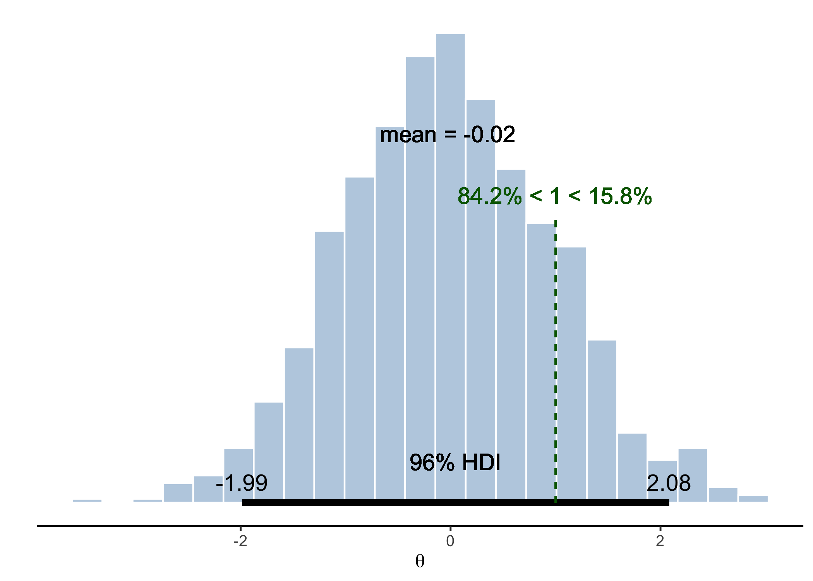

<!-- README.md is generated from README.Rmd. Please edit that file -->

# IMSB: Introduction à la modélisation statistique bayésienne

<!-- badges: start -->

 [](https://github.com/lnalborczyk/IMSB2022)
<!-- badges: end -->

The goal of the `imsb` package is to provide all the materials (e.g.,
data, utility functions) needed for the [IMSB
course](https://www.barelysignificant.com/IMSB2022/).

## Installation

You can install the development version of `imsb` from GitHub with:

``` r
install.packages("remotes")
remotes::install_github(repo = "lnalborczyk/IMSB2022/_imsb", dependencies = TRUE)
```

## Usage

Checking the `brms` and `rstan` install.

``` r
library(imsb)
check_install()
```

Opening the slides of the first course in browser.

``` r
open_slides(cours = 01)
```

Importing the `robot` data.

``` r
open_data(robot)
```

Posterior plot in the style of the `BEST` package using the
`imsb::posterior_plot()` function.

``` r
# getting samples for a normal distribution
samples <- rnorm(n = 1e3, mean = 0, sd = 1)

# plotting it
posterior_plot(samples, credmass = 0.96, compval = 1) +
    # the resulting plot is a ggplot than can be customised at will
    ggplot2::labs(x = expression(theta) )
```


