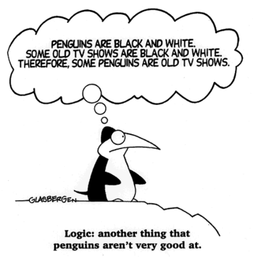
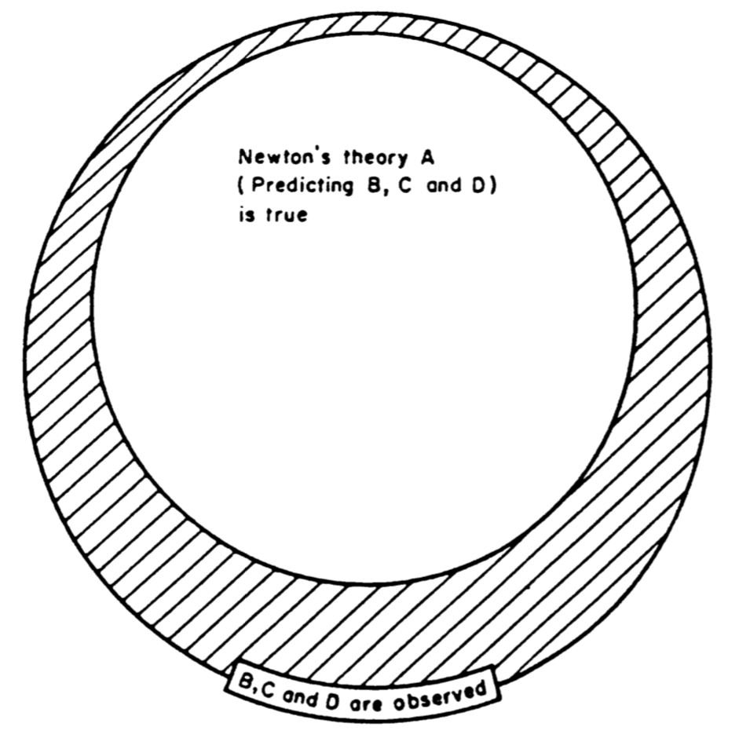
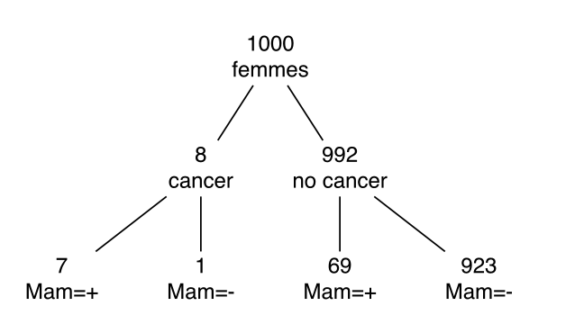
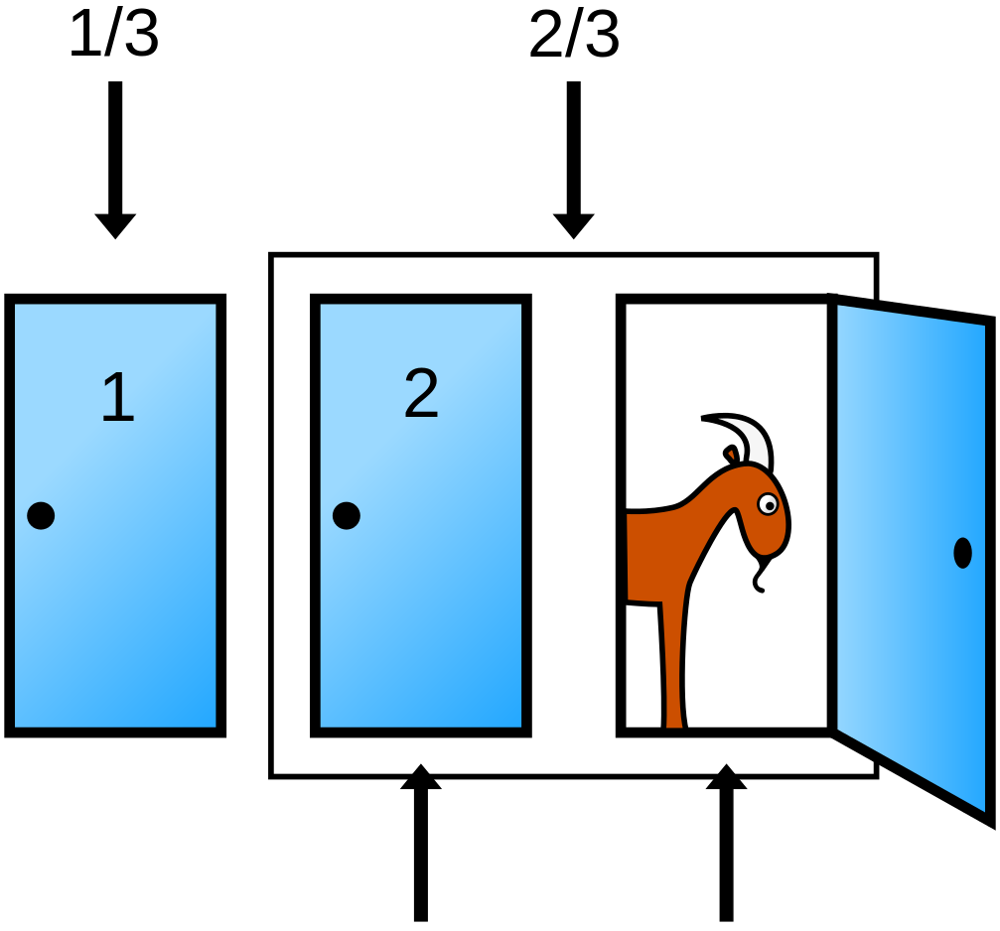
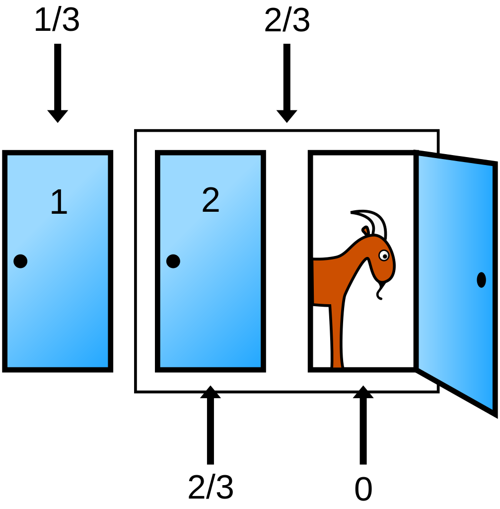

# Introduction à l'inférence bayésienne {#introduction}

```{r setup-ch1, include = FALSE, message = FALSE}
library(tidyverse)
library(papaja)
library(knitr)
library(imsb)

# setting up knitr options
opts_chunk$set(
  cache = TRUE, echo = TRUE, warning = FALSE, message = FALSE,
  fig.align = "center", out.width = "75%", fig.pos = "!htb"
  )
```

\definecolor{steelblue}{RGB}{70, 130, 180}
\definecolor{green}{RGB}{0, 153, 0}
\definecolor{purple}{RGB}{153, 0, 153}
\definecolor{orangered}{cmyk}{0, 73, 100, 0}
\newcommand\given[1][]{\:#1\vert\:}

\epigraph{"The numbers have no way of speaking for themselves. We speak for them. We imbue them with meaning"}{Nate Silver}

Notre environnement est rempli d'incertitude. Quel temps fera-t-il demain ? Qui sera le prochain président de la République ? Vais-je apprendre quelque chose en lisant ce livre ? Tout individu est capable de se faire une idée intuitive de la réponse à ces questions (avec plus ou moins de réussite) sans avoir jamais lu aucun livre traitant formellement de théorie des probabilités. Cependant, un examen plus détaillé des processus menant à ces réponses révèle une complexité et une diversité insoupçonnées. Qu'est-ce qu'une probabilité ? À quoi le concept de probabilité réfère-t-il, concrètement, dans le monde ? Et surtout, à quoi est-ce que tout cela pourrait bien nous servir pour l'analyse de données ?

Dans ce premier chapitre, nous allons approfondir cette réflexion sur le concept de probabilité en se basant sur plusieurs définitions ayant été proposées au fil du temps. Puis, nous discuterons plus particulièrement de l'inférence bayésienne, une approche de l'inférence statistique qui utilise les probabilités comme langage pour décrire l'incertitude (et où le concept de **probabilité** est à comprendre dans son acception **épistémique**). Nous proposerons également un bref rappel de théorie des probabilités avant de dériver le théorème de Bayes à partir des règles élémentaires du calcul probabiliste. Le théorème de Bayes est le "moteur" de l'inférence statistique bayésienne, permettant de mettre à jour un état de connaissance a priori (i.e., avant d'observer certaines données) en un état de connaissance a posteriori (i.e., après avoir observé ces données). Nous illustrerons ce mécanisme par plusieurs exemples concrets.

## Qu'est-ce qu'une probabilité ?

### Axiomes des probabilités

Pour quantifier notre incertitude vis à vis de la survenue de certains **événements** (e.g., obtenir un chiffre pair lors d'un lancer de dé), on assigne des probabilités à ces événements. On définit une probabilité comme une valeur numérique assignée à un événement $A$, compris comme une possibilité appartenant à l'univers $\Omega$ (l'ensemble de tous les événements possibles). Les probabilités telles que définies et utilisées dans ce livre se conforment aux axiomes suivants [@kolmogorov_foundations_1933]^[On notera au passage que les axiomes de Kolmogorov représentent un exemple parmi d'autres d'ensemble de règles permettant de définir ce qu'est une probabilité, mais que ce n'est pas le seul (bien que ce soit le plus communément utilisé). Par exemple, les [axiomes de Cox](https://en.wikipedia.org/wiki/Cox%27s_theorem) offrent un cadre alternatif.] :

- **Axiome n°1** : $\Pr(A) \geq 0$. La probabilité d'un événement $A$ ne peut pas être négative.

- **Axiome n°2** : $\Pr(\Omega) = 1$. La somme des probabilités de tous les événements possibles est égale à $1$ (et par conséquent, chaque probabilité individuelle ne peut dépasser $1$).

- **Axiome n°3** : $\Pr(A_{1} \cup A_{2}) = \Pr(A_{1}) + \Pr(A_{2})$. La probabilité d'obtenir soit l'événement $A_{1}$, soit l'événement $A_{2}$ (sachant que ces événements sont **incompatibles**) est égale à la somme des probabilités de chacun de ces deux événements.

Le dernier axiome est également connu comme la **règle de la somme** et n'est valide dans cette forme que pour des événements deux à deux **incompatibles** ou **mutuellement exclusifs**.^[Deux événements $A_{1}$ et $A_{2}$ sont dits *incompatibles* si l'on ne peut avoir les deux en même temps, c'est à dire si la probabilité de leur intersection  est nulle : $\Pr(A_{1} \cap A_{2}) = 0$.] Il se généralise à des événements non mutuellement exclusifs de la manière suivante : $\Pr(A_{1} \cup A_{2}) = \Pr(A_{1}) + \Pr(A_{2}) - \Pr(A_{1} \cap A_{2})$. Autrement dit, et pour résumer, une probabilité est une valeur numérique positive, bornée entre 0 et 1, et qui respecte la règle de la somme.

### Interprétations probabilistes

Bien que nous ayons donné ci-dessus une définition des probabilités, cela ne nous donne aucune indication sur la manière d'interpréter ce genre de valeur. Qu'est-ce qu'une probabilité ? À quoi dans le monde fait référence une probabilité ? Cette question fait encore aujourd'hui couler beaucoup d'encre en philosophie de la connaissance. Nous discutons ci-dessous brièvement de quelques interprétations possibles du concept de probabilité.

#### Interprétation classique (ou théorique)

La première interprétation proposée est généralement la première définition que nous rencontrons dans notre cursus scolaire. Il s'agit également d'une interprétation précédent l'observation de données. En effet, dans ce cadre, une probabilité peut être calculée avant même d'avoir observé quelque donnée que ce soit, par simple connaissance du système étudié. Plus précisément, on définit la probabilité comme le rapport entre le nombre de cas favorables sur le nombre de cas possibles. Par exemple, si on s'intéresse à la probabilité de l'événement "Obtenir un chiffre pair" lors du lancer d'un dé (non pipé), alors cette probabilité peut se calculer de la manière suivante :

$$
\Pr(\text{pair}) = \frac{\text{nombre de cas favorables}}{\text{nombre de cas possibles}} = \frac{3}{6} = \frac{1}{2} \cdot
$$

Cette définition fonctionne bien pour les situations dans lesquelles il n'y a qu'un nombre **fini** de résultats possibles **équiprobables** (i.e., de même probabilité). Cependant, si on applique cette définition à des situations plus complexes, on se rend compte que sa portée est limitée. Par exemple, si on applique cette définition à la question suivante : "Quelle est la probabilité qu'il pleuve demain ?", on se retrouve avec le calcul suivant :

$$
\Pr(\text{pluie}) = \frac{\text{pluie}}{ \{\text{pluie, non-pluie} \} } = \frac{1}{2}
$$

Et on se rend compte assez facilement que cette définition ne s'applique pas à des situations de prédiction météorologique, où il peut exister un grand nombre d’évènements possibles n'ayant pas nécessairement la même probabilité.

#### Interprétation fréquentiste (ou empirique)

L'interprétation fréquentiste du concept de probabilité propose que la probabilité est ce vers quoi tend le rapport présenté dans la section précédente lorsque le nombre d'essais s'approche de l'infini (i.e., lorsque le nombre d'essais devient très important). Autrement dit, la probabilité est définie de la manière suivante :

$$\Pr(x) = \lim_{n_{t} \to \infty}\frac{n_{x}}{n_{t}}$$

où $n_{x}$ est le nombre d'occurrences de l’événement $x$ et $n_{t}$ le nombre total d'essais. L'interprétation **fréquentiste** postule que, à long-terme (i.e., quand le nombre d'essais s'approche de l'infini), la fréquence relative va converger *exactement* vers ce qu'on appelle "probabilité".

```{r frequency, fig.asp = 0.75, fig.cap = "Illustration de l'interprétation fréquentiste du concept de probabilité. Lorsque le nombre d'essais augmente (en abscisse), la fréquence relative (en ordonnée) converge vers la probabilité d'obtenir Face."} 
library(tidyverse)

sample(x = c(0, 1), size = 500, replace = TRUE) %>%
        data.frame() %>%
        mutate(x = seq_along(.), y = cummean(.) ) %>%
        ggplot(aes(x = x, y = y) ) +
        geom_line(lwd = 1) +
        geom_hline(yintercept = 0.5, lty = 3) +
        labs(x = "Nombre de lancers", y = "Proportion de faces") +
        ylim(0, 1) +
        theme_bw(base_size = 12)
```

La Figure \@ref(fig:frequency) illustre l'**interprétation fréquentiste** du concept de probabilité en montrant que la fréquence relative converge vers une fréquence donnée (la "probabilité") quand le nombre d'essais augmente. Une conséquence importante de cette définition est que le concept de probabilité s'applique uniquement aux **collectifs** (i.e., aux séquences), et non aux événements singuliers. La probabilité est définie comme la limite d'une fréquence relative, et ne permet pas de parler de la probabilité d'un événement unique.

L'interprétation fréquentiste rencontre d'autres problèmes, comme celui de la classe de référence. Considérons par exemple la question suivante : "Quelle est la probabilité que je vive jusqu'à 80 ans ?" Pour répondre à cette question, nous avons besoin de définir la classe de référence à partir de laquelle l'individu examiné ("je") provient. Autrement dit, je peux estimer la probabilité qu'un individu ayant mes caractéristiques vive jusqu'à 80 ans, mais il faut d'abord déterminer quelles sont les caractéristiques importantes au regard de la question posée. Selon mon sexe biologique, ma nationalité, ou mon statut socio-économique, la réponse à cette question peut varier drastiquement. L'interprétation fréquentiste ne propose pas de procédure stricte permettant de définir la classe de référence pertinente.

Par ailleurs, cette définition ne s’applique pas directement aux évènements qui ne peuvent pas se répéter. Par exemple, quelle est la probabilité que j'apprenne quelque chose pendant cette formation ? La réponse à cette question ne peut s'établir qu'en considérant des facteurs extérieurs à la question (e.g., le niveau de connaissance a priori), et ne peut pas reposer sur une évaluation sur le long-terme de la fréquence d'occurrence de l'événement "apprendre quelque chose" (cela n'aurait pas de sens de refaire la formation 1000 fois pour calculer le nombre de fois où on aura appris quelque chose).

<!--

Une autre limite importante de l'interprétation fréquentiste est la question de la résolution (ou précision) du calcul de cette probabilité. À partir de combien de lancers (d'une pièce par exemple) a-t-on une bonne approximation de la probabilité ? On sait qu'une classe finie d’événements de taille $n$ ne peut produire que des fréquences relatives de précision $1/n$. Jusque quand devrions-nous donc continuer "d'échantillonner le long-terme" avant d'avoir une estimation précise de la probabilité ?

-->

#### Interprétation propensionniste

Selon l'interprétation propensionniste du concept de probabilité, les propriétés fréquentistes (i.e., à long terme) des objets (e.g., une pièce) seraient provoquées par des *propriétés physiques intrinsèques* aux objets. Par exemple, une pièce biaisée va engendrer une fréquence relative (et donc une probabilité, selon l'interprétation fréquentiste) biaisée en raison de ses propriétés physiques. Pour les propensionnistes, les probabilités représentent ces caractéristiques intrinsèques, ces **propensions** à générer certaines fréquences relatives, et non les fréquences relatives en elles-mêmes.

Une conséquence intéressante de cette définition (et un progrès par rapport à l'interprétation fréquentiste) est que ces propriétés sont les propriétés d’événements individuels... et non de séquences ! L’interprétation propensionniste nous permet donc de parler de la probabilité d'événements uniques.

#### Interprétation logique

L'interprétation logique du concept de probabilité, comme l'interprétation classique, postule que les probabilités peuvent être déterminées a priori en examinant les caractéristiques du système étudié (e.g., les caractéristiques de l'objet, l'ensemble des événements possibles, etc). Cependant, contrairement à l'interprétation classique, l'interprétation logique permet de rendre compte des événements non équiprobables. Cette interprétation se propose de réaliser cet objectif en généralisant la logique binaire (vrai / faux) au monde probabiliste, en étudiant le degré de support logique fourni par un ensemble de preuves pour une hypothèse donnée. Considérons par exemple l'argument logique ci-dessous.

**Prémisse n°1** : Considérons une salle dans laquelle sont présents 10 étudiants

**Prémisse n°2** : Neuf étudiants portent un t-shirt vert

**Prémisse n°3** : Un étudiant porte un t-shirt rouge

**Prémisse n°4** : Une personne est tirée au sort...

<hr>
\par\noindent\rule{\textwidth}{1pt}

**Conclusion n°1** : L'étudiant tiré au sort porte un t-shirt

Cette conclusion est *vraie* et l'argument qui y est attaché est *valide*. Pour rappel, on dit qu'un argument est *valide* lorsqu'il n'existe aucune situation logiquement possible dans laquelle tous les prémisses de l'argument soient vrais et sa conclusion fausse [@talbot_critical_2015]. Autrement dit, si on considère les prémisses 1 à 4 comme vrais, alors il est (logiquement) impossible pour cette conclusion d'être fausse.

<hr>
\par\noindent\rule{\textwidth}{1pt}

**Conclusion n°2** : L'étudiant tiré au sort porte un t-shirt rouge

Cette conclusion est *fausse* et l'argument qui y est attaché est *invalide.*

<hr>
\par\noindent\rule{\textwidth}{1pt}

**Conclusion n°3** : L'étudiant tiré au sort porte un t-shirt vert

Cette conclusion est également *fausse* et l'argument qui y est attaché est *invalide*. Cependant, on pourrait dire intuitivement que cette conclusion est "un peu moins fausse" que la conclusion précédente (je m'excuse en avance pour les logiciens qui me lisent), dans le sens où elle est "plus fortement" impliquée par les prémisses 1 à 4 que la conclusion n°2.

Bien que les règles de la logique formelle n'autorisent pas des conclusions à être "plus ou moins vraies", l'interprétation logique du concept de probabilité cherche justement à étendre les règles de la logique aux événements continus, et se propose d'utiliser le langage des probabilités dans ce but. Autrement dit, la probabilité représente donc le **degré de support logique** qu'une conclusion peut avoir, relativement à un ensemble de prémices [@carnap_logical_1950;@keynes_treatise_1921].

Une conséquence intéressante de cette interprétation est que toute probabilité est **conditionnelle**, que ce soit à de l'information a priori ou, par exemple, à un ensemble de prémisses.

#### Interprétation bayésienne

Selon l'interprétation bayésienne (subjective), la probabilité est **une mesure du degré de croyance** (ou "crédence") ou d'*incertitude*. Un événement *certain* aura donc une probabilité de 1 et un évènement **impossible** aura une probabilité de 0.

> So to assign equal probabilities to two events is not in any way an assertion that they must occur equally often in any "random experiment"; as Jeffrey emphasized, it is only a formal way of saying "I don't know" [@jaynes_bayesian_1986].

Pour parler de probabilités, dans ce cadre, nous n'avons donc plus besoin de nous référer à la limite d'occurrence d'un évènement (à sa fréquence). La probabilité est un concept abstrait faisant référence à un état de connaissance et / ou permettant de quantifier l'incertitude liée à cet état de connaissance.

#### Interprétations probabilistes - résumé

Pour résumer, les différentes interprétations discutées ci-dessus peuvent être classées dans deux grandes catégories :

> **Interprétation épistémique** : toute probabilité est conditionnelle à de l'information disponible (e.g., prémisses ou données). La probabilité est utilisée comme moyen de quantifier l'incertitude.
>
> Interprétation logique (e.g., Keynes, Carnap), interprétation bayésienne (e.g., Jeffreys, de Finetti, Savage).

> **Interprétation physique** : les probabilités dépendent d'un état du monde, de caractéristiques physiques, elles sont indépendantes de l'information disponible (ou de l'incertitude).
>
> Interprétation classique (e.g., Laplace, Bernouilli, Leibniz), interprétation fréquentiste (e.g., Venn, Reichenbach, von Mises).

Les plus curieux d'entre vous seront ravis de trouver plus d'informations dans cet excellent article de la *Stanford Encyclopedia of Philosophy* [@sep-probability-interpret] sur les différentes interprétations du concept de probabilité.

## Rappels de théorie des probabilités

Pour rappel, une probabilité est donc une valeur numérique comprise entre 0 et 1 et qui respecte la règle de la somme. Ces valeurs sont assignées à des *évènements* $\omega$, étant définis comme des sous-ensembles d'un grand *ensemble* $\Omega$. Chaque évènement de cet ensemble peut se voir assigner une probabilité qui représente notre in(certitude) vis à vis de sa survenue. Ces probabilités sont assignées par des *fonctions de probabilité* qui, à chaque élément $\omega \in \Omega$, associe ou attribue une probabilité [@blitzstein_introduction_2019; @dekking_modern_2005; @noel_psychologie_2015].

Comme illustration, considérons l'exemple suivant. En postulant qu'il est impossible qu'une pièce lancée retombe sur sa tranche, un lancer de pièce peut seulement résulter en deux issues : Pile ou Face. Autrement dit, l'ensemble des issues possibles est défini comme $\Omega = \{\text{Pile}, \ \text{Face}\}$. Étant donné qu'un *évènement* est défini comme un sous-ensemble de $\Omega$, Pile et Face sont donc deux évènements possibles.

```{definition, label = "prob-function", name = "Fonction de probabilité"}
Une fonction de probabilité $p$ définie sur un ensemble fini $\Omega$ assigne à chaque événement $A$ dans $\Omega$ une valeur $\Pr(A) \in [0, 1]$ de manière à ce que :
  
  - $\Pr(\Omega) = 1$ et
  - $\Pr(A \cup B) = \Pr(A) + \Pr(B)$ si $A$ et $B$ sont disjoints.

La valeur $\Pr(A)$ représente la *probabilité* que $A$ se réalise.
```

Dans l'exemple d'un lancer de pièce, si la pièce n'est pas truquée, alors $\Pr(\text{Pile}) = \Pr(\text{Face}) = \frac{1}{2}$...

```{r venn, echo = FALSE, out.width = "100%", fig.cap = "Diagrammes représentant les notions d'intersection, d'union, et de complément."}
knitr::include_graphics(path = "figures/venn.png")
```

...

### Probabilité conjointe

La probabilité conjointe $\Pr(A, B)$ nous indique la probabilité qu'à la fois $A$ et $B$ se réalisent, c'est à dire la probabilité de l'union de $A$ et $B$, qu'on note également $\Pr(A \cap B)$.

```{r conjointe, message = FALSE, echo = TRUE} 
library(tidyverse)

data(HairEyeColor) # données adaptés de Snee (1974)

cont <- apply(HairEyeColor, c(1, 2), sum) %>% t 
cont <- round(cont / sum(cont), 2)
cont
```

Dans chaque cellule du tableau de données ci-dessus, on trouve la **probabilité conjointe** d'avoir telle couleur de cheveux **ET** telle couleur d'yeux, qui s'écrit $\Pr(c, y) = \Pr(y, c)$.

### Probabilité marginale

```{r marginale} 
cont2 <- cont %>% as.data.frame %>% mutate(marginal_eye = rowSums(cont) )
rownames(cont2) <- row.names(cont)
cont2
```

On peut aussi s'intéresser à la probabilité d'avoir des yeux bleus, de manière générale. Il s'agit de la probabilité **marginale** de l’évènement *yeux bleus*, qui s'obtient par la somme de toutes les probabilités jointes impliquant l’évènement *yeux bleus*. Elle s'écrit $\Pr(y)$.

```{r marginale2}
cont3 <- rbind(cont2, colSums(cont2) )
rownames(cont3) <- c(row.names(cont2), "marginal_hair")
cont3
```

On peut bien entendu aussi s'intéresser aux probabilités des couleurs de cheveux, de manière générale. Elle s'écrit $\Pr(c)$.

### Probabilité conditionnelle

On pourrait aussi s'intéresser à la probabilité qu'une personne ait les cheveux blonds, **sachant** qu'elle a les yeux bleus. Il s'agit d'une probabilité **conditionnelle**, et s'écrit $p(c|y)$. Cette probabilité conditionnelle peut se ré-écrire: $p(c|y)= \frac{p(c,y)}{p(y)}$.

```{r cond1, echo = FALSE, eval = TRUE} 
cont3["Blue", ]
```

Par exemple, quelle est la probabilité d'avoir des yeux bleus lorsqu'on a les cheveux blonds ?

```{r cond2, echo = TRUE, eval = TRUE} 
cont3["Blue", "Blond"] / cont3["Blue", "marginal_eye"]  
```

On remarque dans le cas précédent que $p(blonds|bleus)$ **n'est pas nécessairement égal** à $p(bleus|blonds)$.

Autre exemple: la probabilité de mourir sachant qu'on a été attaqué par un requin n'est pas la même que la probabilité d'avoir été attaqué par un requin, sachant qu'on est mort ([*confusion of the inverse*](https://en.wikipedia.org/wiki/Confusion_of_the_inverse)). De la même manière, $p(data|H_{0}) \neq p(H_{0}|data)$.

À partir des axiomes de Kolmogorov (cf. début du cours), et des définitions précédentes des probabilités conjointes, marginales, et conditionnelles, découle la **règle du produit** (en multipliant chaque côté par $p(y)$) :

$$p(a, b) = p(b) \cdot p(a|b) = p(a) \cdot p(b|a)$$

...

### Dérivation du théorème de Bayes

$$p(x, y) = p(x|y) p(y) = p(y|x)p(x)$$

$$p(y|x)p(x) = p(x|y)p(y)$$

$$p(y|x) = \dfrac{p(x|y)p(y)}{p(x)}$$

$$p(x|y) = \dfrac{p(y|x)p(x)}{p(y)}$$

On retrouve le résultat présenté dans la section précédente, en remplaçant $x$ par *données* et $y$ par *hypothèse* :

$$
\Pr(\text{hypothèse} \ | \ \text{données}) = \frac{\Pr(\text{données} \ | \ \text{hypothèse}) \times \Pr(\text{hypothèse})}{\text{Somme des produits}}
$$

...

### Loi de probabilité, cas discret

...

```{definition, label = "PMF", name = "Fonction de masse de probabilité"}
La fonction de masse de probabilité $p$ d'une variable aléatoire $X$ is la fonction $p : \mathbb{R} \rightarrow [0, 1]$, définie par :

$$p(a) = \Pr(X = a) \quad \text{for} - \infty < a < \infty$$
```

Une fonction de masse (*probability mass function*, ou *PMF*) est une fonction qui attribue une probabilité à chaque valeur d'une variable aléatoire. Exemple de la distribution binomiale pour une pièce non biaisée ($\theta = 0.5$), indiquant la probabilité d'obtenir $N$ faces sur 10 lancers. 

```{r binomial-barplot, echo = FALSE, out.width = "50%", fig.cap = "Distribution de la probabilité d'obtenir N 'Face' sur 10 lancers de pièce."}
coin <- dbinom(x = 0:10, size = 10, prob = 0.5)

barplot(
  coin, names.arg = 0:10, border = NA,
  axes = FALSE, cex.names = 1.5, col = "grey20"
  )
```

Somme à 1...

```{r eval-dbinom, eval = TRUE, echo = TRUE}
# PMFs sum to 1
dbinom(x = 0:10, size = 10, prob = 0.5) %>% sum
```

### Loi de probabilité, cas continu

```{definition, label = "PDF", name = "Fonction de densité de probabilité"}
Une variable aléatoire $X$ est dite *continue* si pour une fonction donnée $p : \mathbb{R} \rightarrow \mathbb{R}$ et pour tout nombres $a$ et $b$ avec $a \leq b$,

$$\Pr(a \leq X \leq b) = \int_{a}^{b} p(x) \mathrm{d} x$$

La fonction $p$ doit satisfaire la condition $p(x) \geq 0$ pour tout $x$ et $\int_{-\infty}^{\infty} p(x) \mathrm{d} x = 1$. On appelle $p$ la fonction de densité de probabilité (ou densité de probabilité) de $X$.
```

Une fonction de densité de probabilité (*probability density function*, ou *PDF*), est une fonction qui permet de représenter une loi de probabilité sous forme d'intégrales (l'équivalent de la PMF pour des variables aléatoires strictement continues).

```{r pdf-plot, echo = FALSE, out.width = "50%", fig.cap = "Blah blah..."}
data.frame(x = c(0, 200) ) %>%
    ggplot(aes(x) ) +
    stat_function(
        fun = dnorm,
        args = list(mean = 100, sd = 15),
        lwd = 2
        ) +
    theme_bw(base_size = 12) +
    xlab("QI") + ylab("")
```

```{r integrate-pdf, echo = TRUE}
# PDFs integrate to 1
integrate(dnorm, -Inf, Inf, mean = 100, sd = 15)
```

...

```{r pdf-html, eval = knitr::opts_knit$get("rmarkdown.pandoc.to") == "html", results = "asis", echo = FALSE, purl = FALSE}
cat('
<div class = "keyconcept" id="KC1.1">
<h3 class = "right"> Concept essentiel 1.1 </h3> 
<h3 class = "left"> Variable aléatoire continue </h3>
<p>
Une variable aléatoire continue peut prendre (littéralement) une infinité de valeurs. On se retrouve donc face un problème. Si on attribue une probabilité non-nulle à chacune de ces valeurs (à une infinité de valeurs donc), la somme des probabilités de ces valeurs sera elle aussi infinie, et cette fonction ne pourra donc pas être considérée comme une fonction de probabilité. Pour pallier à ce problème, chaque valeur ponctuelle d\'une variable aléatoire est assignée une probabilité nulle (i.e., $\\Pr(X = x) = 0$) et uniquement des intervalles (e.g., $\\Pr(a < x < b)$) peuvent se voir attribuer une probabilité.
</p> 
</div>')
```

```{r pdf-pdf, eval = knitr::opts_knit$get("rmarkdown.pandoc.to") == "latex", results = "asis", echo = FALSE, purl = FALSE}
cat("\\begin{keyconcepts}[Variable aléatoire continue]{1.1}
Une variable aléatoire continue peut prendre (littéralement) une infinité de valeurs. On se retrouve donc face un problème. Si on attribue une probabilité non-nulle à chacune de ces valeurs (à une infinité de valeurs donc), la 'somme' (l'intégrale) des probabilités de ces valeurs sera elle aussi infinie, et cette fonction ne pourra donc pas être considérée comme une fonction de probabilité. Pour pallier à ce problème, chaque valeur ponctuelle d'une variable aléatoire est assignée une probabilité nulle (i.e., $\\Pr(X = x) = 0$) et uniquement des intervalles (e.g., $\\Pr(a < x < b)$) peuvent se voir attribuer une probabilité.
\\end{keyconcepts}")
```

...

### Aparté, qu'est-ce qu'une intégrale ?

Une intégrale correspond à la **surface** (aire géométrique) délimitée par la représentation graphique d'une fonction, *l'aire sous la courbe*. Une distribution est dite **impropre** si son intégrale n'est pas égale à un nombre fini (e.g., $+ \infty$) et **normalisée** si son intégrale est égale à 1.

```{r integral, echo = FALSE, fig.width = 7, fig.height = 5, fig.cap = "Blah blah..."}
cord.x <- c(90, seq(90, 96, 0.01), 96) 
cord.y <- c(0, dnorm(seq(90, 96, 0.01), 100, 15), 0) 

data.frame(x = c(0, 200) ) %>%
    ggplot(aes(x) ) +
    stat_function(
        fun = dnorm,
        args = list(mean = 100, sd = 15),
        lwd = 2,
        color = "black"
        ) +
    geom_polygon(
        data = data.frame(cord.x, cord.y),
        aes(cord.x, cord.y),
        color = "black"
        ) +
    theme_bw(base_size = 12) +
    xlab("QI") + ylab("Probability density")
```

```{r integral-qi, echo = FALSE, fig.width = 7, fig.height = 5, fig.cap = "Blah blah..."}
data.frame(x = c(0, 200) ) %>%
    ggplot(aes(x) ) +
    stat_function(
        fun = dnorm,
        args = list(mean = 100, sd = 15),
        lwd = 2
        ) +
    geom_polygon(
        data = data.frame(cord.x, cord.y),
        aes(cord.x, cord.y)
        ) +
    theme_bw(base_size = 12) +
    xlab("QI") + ylab("Probability density")
```

L'intégrale de $f(x)$ sur l'intervalle [90 ; 96] vaut: $p(90 < x < 96) = \int_{90}^{96} f(x) \ \mathrm{d}x = 0.142$.

```{r integrate-pdf-qi}
integrate(dnorm, 90, 96, mean = 100, sd = 15)
```

### Notations, terminologie

Ayant introduit de manière intuitive les concepts centraux de l'inférence bayésienne (en particulier, la mise à jour d'un connaissance a posteriori en une connaissance a posteriori) nous allons maintenant établit la terminologie qui nous accompagner au fil de ce livre.

- $\theta$ désigne habituellement un paramètre ou un vecteur de paramètres (e.g., la proportion de billes bleues)

- $\color{orangered}{p(x\vert \theta)}$ <span style="color:orangered"> désigne la probabilité conditionnelle des données $x$ sachant le paramètre $\theta$ </span> $\color{orangered}{[p(x | \theta = \theta)]}$

- $\color{orangered}{p(x\vert \theta)}$ <span style="color:orangered"> une fois que la valeur de $x$ est connue, est vue comme la fonction de vraisemblance (*likelihood*) du paramètre $\theta$. Attention, il ne s'agit pas d'une distribution de probabilité (n'intègre pas à 1). </span> $\color{orangered}{[p(x = x | \theta)]}$

- $\color{steelblue}{p(\theta)}$ <span style="color:steelblue"> la probabilité a priori de $\theta$</span>
- $\color{purple}{p(\theta \vert x)}$ <span style="color:purple"> la probabilité a posteriori de $\theta$ (sachant $x$)</span>
- $\color{green}{p(x)}$ <span style="color:green"> la probabilité marginale de $x$ (sur $\theta$)</span>

<br>

$$
\color{purple}{p(\theta \vert x)} = \dfrac{\color{orangered}{p(x\vert \theta)} \color{steelblue}{p(\theta)}}{\color{green}{p(x)}} = \dfrac{\color{orangered}{p(x\vert \theta)} \color{steelblue}{p(\theta)}}{\color{green}{\sum\limits_{\theta}p(x|\theta)p(\theta)}} = \dfrac{\color{orangered}{p(x\vert \theta)} \color{steelblue}{p(\theta)}}{\color{green}{\int\limits_{\theta}p(x|\theta)p(\theta)\mathrm{d}x}} \propto \color{orangered}{p(x\vert \theta)} \color{steelblue}{p(\theta)}
$$

...

```{r logic-html, eval = knitr::opts_knit$get("rmarkdown.pandoc.to") == "html", results = "asis", echo = FALSE, purl = FALSE}
cat('
<div class = "keyconcept" id="KC1.1">
<h3 class = "right"> Concept essentiel 1.1 </h3> 
<h3 class = "left"> La théorie des probabilités comme extension de la logique </h3>
<p>
La théorie des probabilités est parfois présentée comme une extension de la logique. En effet, elle généralise les règles de la logique qui s\'appliquent à des événements discrets (vrais ou faux) à des événements continus. Ce faisant, les probabilités nous permettent de décrire et quantifier l\'incertitude. Il est important de souligner que les règles du calcul probabiliste ont le même statut que les règles logiques : ces règles de base peuvent être utilisées pour déduire des conclusions qui seront garanties d\'être correctes, si les prémises sont corrects.

Dans ce cadre, l\'analyse statistique bayésienne peut être conceptualisée comme une application de la théorie des probabilités à l\'analyse statistique. Bien que la dépendance des conclusions de ce genre d\'analyse aux a priori qu\'elles rendent explicitent est souvent présenté comme une faiblesse, c\'est précisémment ce qui les rend "optimales" ou "cohérentes" (au sens où elles respectent les règles du calcul probabiliste). Comme résumé par Vandekerckhove (2018), conclure que les analyses bayésiennes seraient invalidées par l\'utilisation d\'informations a priori serait similaire à conclure que des déductions logiques seraient invalidées par la considération de prémisses.
</p> 
</div>')
```

```{r logic-pdf, eval = knitr::opts_knit$get("rmarkdown.pandoc.to") == "latex", results = "asis", echo = FALSE, purl = FALSE}
cat("\\begin{keyconcepts}[La théorie des probabilités comme extension de la logique]{1.1}
La théorie des probabilités est parfois présentée comme une extension de la logique. En effet, elle généralise les règles de la logique qui s\\' appliquent à des événements discrets (vrais ou faux) à des événements continus. Ce faisant, les probabilités nous permettent de décrire et quantifier l\\' incertitude. Il est important de souligner que les règles du calcul probabiliste ont le même statut que les règles logiques : ces règles de base peuvent être utilisées pour déduire des conclusions qui seront garanties d\\' être correctes, si les prémises sont corrects.

Dans ce cadre, l\\' analyse statistique bayésienne peut être conceptualisée comme une application de la théorie des probabilités à l\\'analyse statistique. Bien que la dépendance des conclusions de ce genre d\' analyse aux a priori qu\'elles rendent explicitent est souvent présenté comme une faiblesse, c\\'est précisémment ce qui les rend 'optimales' ou 'cohérentes' (au sens où elles respectent les règles du calcul probabiliste). Comme résumé par Vandekerckhove (2018), conclure que les analyses bayésiennes seraient invalidées par l\\' utilisation d\\' informations a priori serait similaire à conclure que des déductions logiques seraient invalidées par la considération de prémisses.
\\end{keyconcepts}")
```

## Logique et raisonnement scientifique

### Introduction à la logique

Le but de cette section est de proposer une courte (et très incomplète) introduction à la logique, afin de pouvoir analyser dans une section ultérieure l'argument central de l'inférence fréquentiste et d'illustrer les similarités entre la logique et le fonctionnement de l'inférence bayésienne. Commençons tout d'abord par définir les termes utilisés [cf. @talbot_critical_2015].

```{definition, label = "argument"}
Un *argument* est un ensemble de propositions dans lequel une proposition est affirmée sur la base d'autres propositions.
```

Un argument (du moins tel que défini ici) est donc composé de différentes propositions. Parmi ces propositions, certaines vont être utilisées pour affirmer une autre proposition.

```{definition, label = "concusion"}
La *conclusion* est l'affirmation faite sur la base d'autres propositions.
```

```{definition, label = "prémisse"}
Les *prémisses* d'un argument sont les raisons offertes qui permettent d'affirmer la conclusion.
```

Pour résumer, un *argument* est un ensemble de propositions, parmi lesquelles des *prémisses* sont utilisées pour affirmer une *conclusion*. Les propositions qui composent un *argument* (i.e., les prémisses et la conclusion) peuvent être *vraies* ou *fausses* mais l'argument ne peut pas être *vrai* ou *faux*. Un argument est seulement *valide* ou *invalide*.

```{definition, label = "valide"}
Un argument est dit *valide* si et seulement si il n'existe aucune situation logiquement possible dans laquelle tous les prémisses de l'argument soient vrais et sa conclusion fausse.
```

```{definition, label = "invalide"}
Un argument est dit *invalide* si et seulement si il existe aucune situation logiquement possible dans laquelle tous les prémisses de l'argument soient vrais et sa conclusion fausse.
```

Pour résumer, un argument est un ensemble de *propositions*, dont certaines d'entre elles (les prémisses) sont utilisées pour affirmer (ou justifier) une autre (la conclusion). Ces propositions peuvent être vraies ou fausses mais un argument peut seulement être *valide* ou *invalide*. Un argument est dit *valide* lorsqu'il est logiquement *impossible* pour la conclusion d'être fausse (sachant que les prémisses sont *vraies*).

### Quelques syllogismes connus

```{r penguin, eval = TRUE, echo = FALSE, out.width = "50%", fig.cap = "Un pingouin s'essayant à la logique. Source : https://www.pinterest.com/pin/465418942711158498/."}

```

Un syllogisme est un raisonnement logique qui met en relation *au moins* trois propositions : au moins deux prémisses et une conclusion. Afin d'illustrer les définitions proposées ci-dessus, nous allons maintenant examiner quelques exemples. Savez-vous reconnaître les arguments valides et invalides ?

**Argument n°1**

- Prémisse n°1 : Si un suspect ment, il transpire.
- Prémisse n°2 : (On observe que) Ce suspect transpire.
- Conclusion : Par conséquent, ce suspect ment.

Cet argument est *invalide* car (on applique la définition \@ref(def:valide)) il existe des situations dans lesquelles à la fois les prémisses 1 et 2 sont vraies, et pourtant la conclusion est fausse. Par exemple, il se peut que le suspect transpire pour d'autres raisons que le mensonge (e.g., la température de la salle d'interrogatoire).

**Argument n°2**

- Prémisse n°1 : Si un suspect transpire, il ment.
- Prémisse n°2 : (On observe que) Ce suspect ne transpire pas.
- Conclusion : Par conséquent, ce suspect ne ment pas.

Cet argument est également *invalide* car il existe des situations dans lesquelles à la fois les prémisses 1 et 2 sont vraies, et pourtant la conclusion est fausse. Par exemple, il se peut que le suspect fasse partie des gens qui ne transpirent pas lorsqu'ils mentent.

**Argument n°3**

- Prémisse n°1 : Tous les menteurs transpirent.
- Prémisse n°2 : (On observe que) Ce suspect ne transpire pas.
- Conclusion : Par conséquent, ce suspect n'est pas un menteur.

Cet argument est *valide* car il n'existe aucune situation dans laquelle à la fois les prémisses 1 et 2 sont vraies et la conclusion serait fausse. Autrement dit, si les prémisses 1 et 2 sont vraies, il est *logiquement impossible* pour la conclusion d'être fausse. Nous allons maintenant examiner quelques raisonnements valides et invalides connus afin de nous aider à les repérer plus facilement.

#### Arguments invalides

Le premier raisonnement fallacieux que nous allons étudier est connu comme le sophisme de l'**affirmation du conséquent**. Ce raisonnement vise à inférer la réalisation d'un *antécédent* sur la base de la réalisation du *conséquent.* Considérons l'exemple suivant :

- Prémisse n°1 : S'il a plu, alors le sol est mouillé (A implique B).
- Prémisse n°2 : Le sol est mouillé (B).
- Conclusion : Donc il a plu (A).

Dans cet argument, le prémisse n°1 nous dit que l'antécédent (A) implique le conséquent (B). Le prémisse n°2 *affirme* le conséquent B. La conclusion consiste à affirmer l'antécédent A sur la base de ces deux prémisse. Or cet argument est invalide, car (en l'occurrence) le sol pourrait être mouillé pour d'autres raisons que la pluie. Il s'agit du même genre de raisonnement que l'argument n°1 discuté dans la section précédente et il peut s'écrire dans une forme générale de la manière suivante :

$$\dfrac{A \Rightarrow B, \ B}{A}$$

où $A \Rightarrow B$ se lit "A implique B" et se comprend comme dans la phrase "Si A, alors B".

Un deuxième argument fallacieux relativement répandu est connu comme le sophisme de la **négation de l'antécédent** et consiste à affirmer une négation du conséquent (i.e., non B) sur la base d'une négation de l'antécédent (i.e., non A). Considérons l'exemple suivant :

- Prémisse n°1 : S'il a plu, alors le sol est mouillé (A implique B).
- Prémisse n°2 : Il n'a pas plu (non A).
- Conclusion : Donc le sol n'est pas mouillé (non B).

Dans cet exemple comme dans le précédent, le prémisse n°1 nous dit que l'antécédent (A) implique le conséquent (B). Le prémisse n°2 affirme une négation de l'antécédent (i.e., non A ou $\neg A$). La conclusion consiste à affirmer une négation du conséquence (i.e., $\neg B$) sur la base de ces deux prémisses. Cet argument est également invalide car (en l'occurrence) le sol pourrait être mouillé pour d'autres raisons que le pluie. Autrement dit :

$$\dfrac{A \Rightarrow B, \ \neg A}{\neg B}$$

où $\neg A$ représente la négation de A (i.e., non A).

#### Arguments valides

Attardons nous maintenons sur deux des raisonnements valides les plus connus. Le premier est connu comme le **modus ponens** et consiste à déduire un conséquent sur la base d'une implication (e.g., A implique B) et de l'affirmation d'un antécédent. Considérons l'exemple suivant :

- Prémisse n°1 : Si on est lundi, alors John ira au travail (A implique B).
- Prémisse n°2 : On est lundi (A).
- Conclusion : Donc John ira au travail (B).

Comme dans les deux exemples précédents, le prémisse n°1 nous dit que l'antécédent (A) implique le conséquent (B). Le prémisse n°2 *affirme* l'antécédent A. La conclusion consiste à affirmer le conséquent B sur la base de ces deux prémisse. Cet argument est *valide* (cf. définition \@ref(def:valide)) car il n'existe aucune situation *logiquement possible* dans laquelle les deux prémisses serait vrais et la conclusion fausse. Autrement dit, cet argument est valide car il est *impossible* pour la conclusion d'être fausse, sachant que les prémisses sont vrais. Le modus ponens peut s'écrire de la manière suivante : 

$$\dfrac{A \Rightarrow B, \ A}{B} \cdot$$

Le deuxième argument valide que nous allons discuter est connu comme le **modus tollens**, dont l'importance s'avère capitale dans le raisonnement scientifique, ou du moins dans sa version idéalisée (cf. section suivante). Cet argument consiste à déduire la négation de l'antécédent sur la base d'une implication et de la négation du conséquent. Considérons l'exemple suivant :

- Prémisse n°1 : Si mon chien détecte un intrus, alors il aboie (A implique B).
- Prémisse n°2 : Mon chien n'a pas aboyé (non B).
- Conclusion : Donc il n'a pas détecté d'intrus (non A).

Comme dans les exemples précédents, le prémisse n°1 nous dit que l'antécédent (A) implique le conséquent (B). Le prémisse n°2 affirme la ngation du conséquent (i.e., non B). La conclusion consiste à affirmer la négation de l'antécédent (i.e., non A) sur la base de ces deux prémisses. Cet argument est *valide* (cf. définition \@ref(def:valide)) car il n'existe aucune situation *logiquement possible* dans laquelle les deux prémisses serait vrais et la conclusion fausse. Autrement dit, cet argument est valide car il est *impossible* pour la conclusion d'être fausse, sachant que les prémisses sont vrais. Dans notre exemple, si le chien n'a pas aboyé, c'est *nécessairement* qu'il n'a pas détecté d'intrus. Cependant, cela ne veut pas dire qu'aucun intrus a visité notre maison, seulement que le chien n'a pas détecté d'intrus. Le modus tollens peut s'écrire de la manière suivante :

$$\dfrac{A \Rightarrow B, \ \neg B}{\neg A}$$

Ayant défini ce qu'est un argument, ce qui le compose et ce qui fait sa validité, nous disposons maintenant des outils nécessaires afin d'étudier la "logique" du raisonnement scientifique, et d'essayer de voir la place occupée par l'analyse de données dans ce raisonnement.

### Qu'est-ce qu'une théorie scientifique ?

Qu'est-ce qu'une théorie scientifique ? D'un point de vue très général, une théorie scientifique peut être définie comme un ensemble de propositions logiques qui postulent des relations causales entre des phénomènes observables. Dans un premier temps, ces propositions sont formulées en termes abstraits et généraux (e.g., "tout objet répond à la force de gravité de manière similaire"), mais mènent ensuite à des propositions concrètes et testable empiriquement (e.g., "la vitesse de chute de deux objets devrait être la même, toute chose étant égale par ailleurs"). Il existe cependant de nombreux "types" de théories scientifiques. Par exemple, @meehl_what_1986 liste trois types de théories :

- *Functional-dynamic theories* : les théories qui relient "les états aux états" ou "les événements aux événements". Par exemple, ce type de théorie décrit comment un changement sur une variable affecte une ou plusieurs autres variable(s).

- *Structural-compositional theories* : les théories qui expliquent "de quoi est composé quelque chose", de quels genres d'objets un plus gros objet est fait (i.e., sa structure), ou comment ces différentes parties sont assemblées.

- *Evolutionary theories* : les théories qui s'intéressent à l'histoire et au développement des choses (e.g., la théorie de l'évolution, la chute de Rome, etc).

Malgré cette diversité, et sans consensus clair sur ce qui fait une bonne ou une mauvaise théorie, la philosophie des sciences nous offre cependant des outils *conceptuels* utiles pour *évaluer* les théories, identifier ce qui les rend plus ou moins "fortes", et évaluer ce qui fait un *test sévère* d'une théorie. Mais comment-on pouant nous évaluer les théories et comment créer des test sévères et pertinents ?

#### On ne peut pas les confirmer

Un premier "problème" avec les théories scientifiques est que nous ne pouvons pas les "confirmer". En effet, selon @campbell_meehlian_1990, le raisonnement scientifique (naif) aurait la forme logique suivante :

- Prémisse n°1 : Si la théorie de Newton (A) est "vraie", alors on devrait observer observer que les marées ont la période B, la trajectoire de Mars la forme C, la trajectoire d'une boule de canon la forme D, etc.

- Prémisse n °2 : Nos observations confirment B, C, et D.

- Conclusion : Donc la théorie de Newton est "vraie".

Or cet argument est invalide. Comme nous l'avons vu dans la section précédente, il s'agit du raisonnement fallacieux d'affirmation du conséquent. Une manière de s'en rendre compte est de réprésenter visuellement la forme de cet argument (cf. Figure \@ref(fig:campbell)).

```{r campbell, echo = FALSE, out.width = "50%", fig.cap = "Relation entre observations et théorie de la gravitation de Newton, selon Campbell (1990)."}

```

L'invalidité de cet argument provient de l'existence de la zone hachurée de la Figure \@ref(fig:campbell), qui contient les autres explications possibles pour les observations que nous avons réalisées. En d'autres termes, observer B, C, et D ne nous permet pas de conclure que la théorie de Newton (A) est vraie, car ces observations pourraient avoir été générées par d'autres phénomènes que ceux postulés par la théorie de Newton. Cependant, observer B, C, D peut tout de même être informatif, selon certaines conditions, au regard de la théorie de Newton. Par exemple, si nous n'avions pas observé B, C, et D, alors nous aurions pu conclure que A était fausse. Donc observer B, C, et D fait que A reste "plausiblement vraie". Une autre manière de le dire est que A a "survécu" au test des observations B, C, et D. Nous verrons un peu plus loin comment la capacité des théories à survivre à un test empirique peut être utilisé comme métrique d'évaluation des théories.

#### On ne peut pas les réfuter (au sens strict)

Armés de nos connaissances en logique, nous avons donc établi qu'une théorie scientifique ne peut pas être *confirmée*. Peut-être pourrions nous alors les *réfuter* ? A-t-on des moyens de montrer qu'une théorie est fausse ? Qu'est-ce que cela veut dire pour une théorie d'être "fausse" ? Selon la pensée influente de Popper, une théorie est falsifiable (ou réfutable) si et seulement si il existe au moins un falsificateur potentiel (i.e., au moins une proposition possible qui soit en contradiction logique avec elle). En d'autres termes, une théorie peut être considérée comme réfutable s'il peut être démontré qu'elle est fausse.

Notons au passage que la falsifiabilité de Popper concerne le problème de la *démarcation* (c'est-à-dire ce qu'est la science et ce qui est la pseudoscience) et définit les pseudosciences comme étant composées de théories non falsifiables (c'est-à-dire des théories qui ne permettent pas d'être réfutées). Mais lorsqu'il s'agit de décrire *comment* la science fonctionne (visée descriptive) ou comment la science *devrait* fonctionner (visée prescriptive), le standard falsificationniste ne fonctionne pas vraiment. En fait, il est quasiment unanimement impossible d'appliquer le falsificationnisme déductif dans des contextes scientifiques concrets [@mcelreath_statistical_2016]. Dans les sections suivantes, nous discutons de quatre problèmes qui nous empêchent de réfuter des théories, à savoir : i) la distinction entre modèle théorique et modèle statistique, ii) le problème de la mesure, iii) la nature probabiliste des hypothèses scientifiques, et enfin iv) le problème de Duhem-Quine.

#### Modèles théoriques et modèles statistiques

Un modèle statistique est un appareil utilisé pour relier, pour faire le lien entre un modèle théorique et certaines données. Il peut être défini comme une instanciation d'une théorie en un ensemble d'énoncés ou de propositions probabilistes [@rouder_interplay_2016]. En général, il n'existe pas de relation univoque entre modèles théoriques et modèles statistiques. Autrement dit, un modèle théorique donné peut être représenté (i.e., implémenté) par différents modèles statistiques et réciproquement, différents modèles statistiques peuvent être construits à partir du même modèle théorique. Par conséquent, la confirmation ou réfutation d'un modèle statistique ne permet pas l'induction strict au modèle théorique.

Par exemple, une pratique statistique courante en sciences expérimentales est le test d'hypothèse nulle fréquentiste (*Null Hypothesis Significance Testing* ou NHST), qui consiste à tester une hypothèse nulle (souvent l'hypothèse d'absence d'effet) afin de confirmer (ou plutôt, corroborer) une hypothèse théorique alternative d'intérêt. Or, le fait de rejeter l'hypothèse d'absence d'effet ne fournit qu'une très faible *corroboration* de l'hypothèse d'intérêt, comme de nombreuses théories peuvent potentiellement prédire un effet non nul. L'hypothèse d'absence d'effet (i.e., l'hypothèse que l'effet est précisémment égal à $0$) est beaucoup plus contraignante (restrictive) que l'hypothèse alternative selon laquelle l'effet n'est pas égal à $0$.

#### Le problème de la mesure

La logique de la réfutation est assez simple et repose sur la puissance du *modus tollens*. Appliqué au raisonnement scientifique, cet argument être présenté de la manière suivante :

- Prémisse n °1 : Si ma théorie $T$ est correcte, alors je devrais observer certaines données $D$.

- Prémisse n°2 : J'observe d'autres données que celles prédites par ma théorie $\lnot D$.

- Conclusion : Donc, ma théorie est fausse $\lnot T$.

Cet argument est parfaitement valide pour les propositions logiques, qui peuvent être soit vraies, soit fausses. Cependant, le premier problème qui apparait lorsqu'on on applique ce raisonnement à des cas concrets de raisonnement scientifique est le problème de l'erreur d'observation (ou erreur de mesure). Toute observation est sujette à de l'erreur, surtout lorsqu'on étudie des phénomènes nouveaux [@mcelreath_statistical_2016].

Considérons un instant un exemple qui nous vient de la Physique, lorsqu'a été rapportée l'observation de [neutrinos](https://en.wikipedia.org/wiki/Neutrino) plus rapides que la vitesse de la lumière [@mcelreath_statistical_2016;@mcelreath_statistical_2020]. Selon Einstein, aucun objet ne peut voyager plus vite que la lumière. Par conséquent, l'observation de certaines particules (en l'occurrence des neutrinos) qui voyageraient à une vitesse supérieure à celel de la lumière pourraient être considérée comme une réfutation flagrante de la théorie de la relativité restreinte.

En 2011, une large équipe de physiciens de renommée internationale ont pourtant annoncé la détection de neutrinos voyageant plus rapidement quela vitesse de la lumière. De manière intéressante, la première réaction de la communauté scientifique ne fut pas d'annoncer que la théorie d'Einstein était réfutée. Bien au contraire, la plus grande partie de la communauté s'est demandée "D'où est-ce que vient l'erreur dans les mesures réalisées par cette équipe ?" [@mcelreath_statistical_2016;@mcelreath_statistical_2020]. L'équipe ayant réalisée ces mesures a de ses voeux appelé à des réplications indépendantes de leurs résultats. Deux ans plus tard et après plusieurs ré-analyses et réplications contradictoires, la communauté était unanime que les résultats qui semblaient contredire la théorie d'Einstein étaient en fait dû à une erreur de mesure (l'équipe ayant réalisé les premières mesures a réalisé plus tard que l'erreur provenait [d'un câble mal branché](https://profmattstrassler.com/articles-and-posts/particle-physics-basics/neutrinos/neutrinos-faster-than-light/opera-what-went-wrong/)).

Cette anecdote de l'histoire des sciences nous apprend au moins deux choses. Premièrement, il est intéressant d'analyser la réaction de la communauté de l'annonce de ces résultats. La théorie de la relativité restreinte ayant accumulé de nombreux succès prédictifs au cours du dernier siècle, la survenue d'une observation si dramatiquement incompatible avec la théorie était perçue comme hautement improbable aux yeux des experts. Cela nous renseigne sur la manière dont les théories scientifiques gagnent en "crédence" aux yeux d'une communauté d'expert, et également comme cette crédence ou l'historique d'une théorie affecte ou influence la manière d'interpréter les observations empiriques. Deuxièmement, cela souligne le fait qu'une observation ou un ensemble d'observation peut difficilement compter comme une réfutation stricte d'une théorique, car il existe (presque) toujours une probabilité de se tromper ou une erreur irréductible dans la précision de la mesure. De manière générale, le problème avec l'erreur de mesure est de savoir si la réfutation d'une théorie $T$ par un ensemble d'observations $D$ est véritable ou simplement superficielle. Sachant que toute mesure est sujette à de l'erreur, toute conclusion scientifique qui repose sur une ou des mesure(s) ne peut qu'apporter une réfutation partielle (exprimée en termes probabilistes) d'une théorie, et non une réfutation stricte (comme en logique formelle).

#### Hypothèses probabilistes

Un autre problème émerge lorsqu'on essaye d'appliquer le modus tollens aux hypothèses scientifiques. Ce problème [désigné comme "illusion permanente" par @gigerenzer_superego_1993] est que la plupart des hypothèses scientifiques ne sont pas vraiment de la forme "tous les cygnes sont blancs" mais sont plutôt de la forme suivante :

- Mon hypothèse est que 90% des cygnes sont blancs.

- Si mon hypothèse est correcte, alors on ne devrait *probablement pas* observer des cygnes noirs.

Sachant cette hypothèse, que peut-on conclure si on observe un cygne noir ? Et bien pas grand chose. Un autre exemple classique en sciences expérimentales est celui de la logique du test d'hypothèse nulle [@cohen_earth_1994] :

- Prémisse n°1 : Si l'hypothèse nulle est vraie, alors ces données sont peu probables.

- Prémisse n °2 : On observe ces données.

- Conclusion : Donc l'hypothèse nulle est improbable.

Cependant, à cause du prémisse probabiliste (prémisse n°1), cet argument est invalide et sa conclusion est fausse. Pour s'en rendre compte, considérons un autre exemple [@cohen_earth_1994;@pollard_probability_1987] :

- Prémisse n°1 : Si un individu est Américain, il est peu probable qu'il soit membre du Congrès.

- Prémisse n°2 : Cet individu n'est pas membre du Congrès.

- Conclusion : Cet individu n'est probablement pas Américain.

Cette conclusion est saugrenue est l'argument est invalide, car il oublie de considérer l'alternative, qui est que si cet individu n'était pas Américain, la probabilité qu'il soit membre du Congrès serait de 0. Cet argument est identique au précédent :

- Prémisse n°1 : Si l'hypothèse nulle est vraie, alors ces données sont peu probables.

- Prémisse n °2 : On observe ces données.

- Conclusion : Donc l'hypothèse nulle est improbable.

Et cet argument est invalide pour les mêmes raisons que le précédent, à savoir i) que le prémisse n°1 est probabiliste (et non discret) et ii) qu'il ne considère pas l'hypothèse alternative. Ainsi, même sans erreur de mesure, on se rend compte que le problème d'hypothèse probabiliste nous empêche de réfuter ce genre d'hypothèse via le modus tollens.

#### Forme logique du test expérimental d'une théorie

Un dernier (mais non des moindres) problème est connu comme la "thèse de Duhem-Quine" ou le "problème de l'indétermination". En pratique, lorsqu'une théorie $T$ est testée, il est nécessaire de faire appel à des hypothèses sous-jacentes (i.e., non explicites) ou à d'autres théories. Ces théories "auxiliaires" nous aident à "connecter" la théorie d'intérêt $T$ avec le "monde réel", afin de faire des préditions concrètes (e.g., "les cygnes blancs et noirs passent la même proportion de leur temps à se ballader, donc la probabilité de les observer dans la nature devrait être égale"). Ces théories auxiliaires sont souvent des théories à propos des outils que nous utilisons (e.g., "le BDI est ou un outil valide pour mesurer le niveau de symptômes dépressifs chez des patients souffrant de dépression chronique"). 

Lorsque nous testons une théorie qui prédit que "Si $O_{1}$" (une manipulation expérimentale), "Alors $O_{2}$" (une observation prédite), ce que nous voulons dire en fait est que l'on devrait observer cette relation *si et seulement si* tous les éléments auxiliaires sont corrects. Ainsi, la structure logique du test empirique d'une théorie $T$ peut être décrit de la manière suivante [@meehl_theoretical_1978;@harlow_problem_1997;@meehl_appraising_1990] :

$$(T \land A_{t} \land C_{p} \land A_{i} \land C_{n}) \to (O_{1} \supset O_{2})$$

où "$\land$" représente une conjonction ("et"), "$\to$" représente une déduction logique, et "$\supset$" représente l'implication logique (e.g., "Si $O_{1}$, Alors $O_{2}$"). $A_{t}$ est une conjonction de théories auxiliares, $C_{p}$ est connu comme le *ceteribus paribus* (i.e., on postule qu'il n'existe pas de facteurs extérieurs non pris en compte et qui pourraient "masquer" l'effet d'intérêt) $A_{i}$ est une théorie auxiliaire concernant les outils utilisés pour mesurer l'effet d'intérêt, et $C_{n}$ est un énoncé à propos des conditions particulières de l'expérience réalisée (i.e., on postule qu'il n'existe pas de bruit ou erreur systématique dans le protocole expérimental).

En d'autres termes, une *conjonction* de tous les éléments du côté gauche de la formule ci-dessus (ce qui inclut notre théorie $T$) implique la partie droite de la formule, c'est à dire "Si $O_{1}$, Alors $O_{2}$". Si l'expérience réalisée nous révèle que cette relation ne tient pas, alors on aimerait pouvoir conclure que notre hypothèse $T$ est réfutée (en appliquant le modus tollens).

Or, une négation de la partie droite de cette formule nous permet seulement d'affirmer une négation de l'**intégralité** de la partie gauche. Autrement dit, ne pas observer une prédiction empirique d'une théorie nous permet de réfuter l'ensemble $T \land A_{t} \land C_{p} \land A_{i} \land C_{n}$, ce qui est très différent d'une réfutation de $T$ [@meehl_appraising_1990]. En termes plus formels, une négation de la conjonction (de gauche) est logiquement équivalent à déclarer une disjonction des conjoints (i.e., soit l'un ou l'autre des composants de la partie gauche est faux).

Pour résumer, ne pas observer quelque chose qui était prédit par une théorie ne permet pas de montrer que cette théorie est fausse, mais cela permet de montrer que la conjonctions de la théorie et des hypothèses auxiliaires est fausse. Une conséquence des quatre problèmes soulevés dans cette section et que la réfutation d'une théorie scientifique n'est jamais logique, mais elle est plutôt **consensuelle** [@mcelreath_statistical_2016;@mcelreath_statistical_2020]. Une proposition théorique est considérée comme réfutée lorsqu'une communauté d'experts a accumulé un grand nombre de preuves variées, issus de protocoles et de groupes de recherches variés, au fil des décennies. Ce travail d'accumulation des preuves s'accompagne de discussions critiques indissociables du travail de développement théorique. En somme, la réfutation d'une théorie est un résultat social, issue d'une communauté d'experts, et n'est (presque) jamais le résultat d'une déduction logique formelle.

### Test d'hypothèse nulle et raisonnement scientifique

<!--

#### Est-ce que le test d'hypothèse nulle est falsificationniste ?

-->

Une croyance répandue en sciences expérimentales est que l'utilisation de la procédure NHST est bien alignée avec la philosophie scientifique de Popper (et implicitement, qu'il s'agit là de quelque chose de souhaitable). Cependant, le parallèle entre la procédure NHST et la philosophie Poppérienne est très approximatif. La logique de la procédure NHST peut être résumée de la manière suivante :

1. On suppose l'hypothèse d'absence d'effet $\mathcal{H}_{0}$.
2. On génère un nombre infini d'échantillons sous cette hypothèse.
3. On compare les données que nous avons observées dans notre expérience à la distribution contrefactuelle des données sous l'hypothèse nulle $\mathcal{H}_{0}$.

Si les données observées semblent suffisamment invraisemblables conditionnellement à $\mathcal{H}_{0}$ (où "suffisamment" correspond au niveau $\alpha$ du test), nous pouvons rejeter l'hypothèse nulle en toute sécurité et considérer ce rejet comme une corroboration de l'hypothèse alternative $\mathcal{H}_{1}$ (quelle que soit l'hypothèse alternative).

En d'autres termes, la seule hypothèse réellement testée (dans la procédure NHST classique) est l'hypothèse nulle, qui est rarement d'intérêt pour le chercheur en train de la tester. Ainsi, afin de réellement aligner cette procédure avec la méthode falsificationniste, il faudrait tester les prédictions de l'hypothése théorique $\mathcal{T}$ réellement d'intérêt, et non les prédictions d'une hypothèse épouvantail $\mathcal{H}_{0}$.^[À ce propos, et comme nous le verrons un peu plus tard, il est possible et relativement facile de généraliser la procédure de calcul des p-valeurs à n'importe quel modèle statistique dans le cadre bayésien, voir par exemple cet article de blog : http://www.barelysignificant.com/post/ppc/.] Comme résumé par @meehl_what_1986 :

> "[...] we have been brainwashed by Fisherian statistics into thinking that refutation of H0 is a powerful way of testing substantive theories".

<!--

Aside from this problem, Fidler et al. (2018) provide four ways in which NHST violates Popperian falsificationism, namely because i) the statistical null model is almost certainly wrong to some degree (the straw-man null hypothesis), ii) substantive hypotheses (our hypotheses of interest) are not put under examination, iii) substantive hypotheses are not developed enough to drive statistical hypotheses and iv) even if all the previous points were solved, we would still need to submit these hypotheses to severe tests, which would require well-powered and well-designed studies, which is not the current norm^[The average statistical power of psychological research has been estimated to be under 50% for the average effect size seen in psychology research (e.g., Szucs & Ioannidis, 2017).].

-->

@fidler_epistemic_2018 décrivent quatre raisons de questionner le parallèle entre la procédure NHST et la méthode falficationniste.

1. L'hypothèse nulle $\mathcal{H}_{0}$ (ou plutôt la *nil hypothesis*, c'est à dire l'hypothèse que la valeur du paramètre testé est précisément $0$) est très probablement fausse car en sciences sociales en particulier "tout tend à être associé avec tout", un phénomène également connu sous le nom de *crud factor* [@meehl_why_1990].

2. La procédure NHST ne teste pas réellement l'hypothèse d'intérêt $\mathcal{T}$, mais seulement l'hypothèse épouvantail $\mathcal{H}_{0}$.

3. De nombreuses hypothèses théories sous-jacentes ne sont pas assez bien développées ou formalisées et ne permettent pas de formuler des hypothèses statistiques.

4. Même si tous les points précédents ont été résolus, nous aurions encore besoin de soumettre ces hypothèses à des tests sévères, ce qui nécessiterait des études bien alimentées et bien conçues, ce qui n'est pas la norme actuelle.^[La puissance statistique moyenne des tests d'hypothèse réalisés en Psychologie est estimée à moins de 50% [e.g.,@szucs_empirical_2017-1].]

<!--

#### Test d'hypothèse fort versus test d'hypothèse faible

-->

Le point n°2 soulevé ci-dessus nous dit que la procédure NHST ne suit pas le falsificationnisme Poppérien car il ne soumet pas la théorie testée à un risque de falification *sévère*, mais seulement à un danger très faible. En d'autres termes, le test d'hypothèse nulle (tel que pratiqué dans la procédure NHST classique) ne soumet pas la théorie sous-jacente (i.e., celle qu'on vise à évaluer via le test de l'hypothèse statistique dérivée de cette première) à un test fort [@harlow_problem_1997;@meehl_appraising_1990;@meehl_theory-testing_1967]. Autrement dit, étant donné que l'hypothèse nulle est facilement réfutée, l'hypothèse alternative est facilement corroborée statistiquement, et donc peu corroborée au niveau théorique.

Ceci étant dit, cette critique porte sur une manière d'utiliser la procédure NHST (qui est aujourd'hui la plus répandue en Psychologie), mais ce n'est pas la seule manière d'utiliser cette procédure. On pourrait très bien utiliser cette procédure afin d'essayer de réfuter notre hypothèse d'intérêt $\mathcal{T}$. @meehl_theory-testing_1967 distingue entre l'usage *fort* et *faible* du test d'hypothèse nulle en comparant l'usage de la procédure NHST en physique et en psychologie. L'usage *faible* du test d'hypothèse nulle, décrit ci-dessus, correspond à tenter de réfuter une hypothèse nulle qui ne nous intéresse pas afin de corroborer une hypothèse alternative d'intérêt.

<!--

But NHST can be used in either a *strong* or a *weak* way (Meehl, 1967; 1990), depending on the statistical hypothesis $H$ that is being tested in order to appraise a substantitve theory $T$ (Meehl, 1997). The *weak use* of NHST corresponds to the situation in which we try to corroborate our theory $T$ by rejecting the (highly implausible) null hypothesis. This use of NHST can be described as weak, mostly because of what is known as the **crud factor** (i.e., the fact that, in the social sciences, everything is correlated), then everything could explain a non-null difference. As a consequence, refuting the null does not really corroborate our favourite alternative hypothesis

-->

L'usage fort du test d'hypothèse nulle nécessite cependant d'avoir une théorie suffisamment développée, à même de prédire une valeur numérique précise pour une observation, ou tout du moins un intervalle réduit de valeurs possibles, ou alors certaines formes de fonctions (e.g., quadratique ou cubique) entre les variables d'intérêt [@harlow_problem_1997]. Dans ce genre de situation, le test d'hypothèse nulle pourrait agir comme un test Poppérien *risqué*, au sens où l'hypothèse testée est soumises à un risque élevé de réfutation [@harlow_problem_1997]. Notons également que la procédure NHST peut être adaptée afin de réfuter des intervalles de valeurs, via les tests d'équivalence [@rogers_using_1993;@lakens_equivalence_2018] ou la procédure HDI+ROPE [@kruschke_doing_2015].

Bien entendu, dans certaines (rares) situations, l'hypothèse d'absence d'effet est théoriquement d'intérêt, et donc viser à réfuter cette hypothèse via un test d'hypothèse nulle représenterait une tentative sérieuse de réfutation. Par exemple il existe certaines théories en Psychologie qui prédisent que certains comportement seraient invariants selon certaines situations [@morey_beyond_2018]. Ces hypothèses peuvent être testées *sévèrement* par un test d'hypothèse nul, car ce dernier les exposerait à un haut risque de réfutation.

<!--

Le *modus tollens* est un des raisonnements logiques les plus importants et les plus performants. Dans le cadre de l'inférence statistique, il s'applique parfaitement au cas suivant: "Si $H_{0}$ est vraie, alors $x$ ne devrait pas se produire. On observe $x$. Alors $H_{0}$ est fausse".

Mais nous avons le plus souvent affaire à des hypothèses "continues", probabilistes.

L'inférence fréquentiste (Fishérienne) est elle aussi probabiliste, de la forme "Si $H_{0}$ est vraie, alors $x$ est peu probable. On observe $x$. Alors $H_{0}$ est peu probable."

Or cet argument est invalide, le *modus tollens* ne s'applique pas au monde probabiliste (e.g., [Pollard & Richardson, 1987](http://citeseerx.ist.psu.edu/viewdoc/download?doi=10.1.1.505.9968&rep=rep1&type=pdf); [Rouder, Morey, Verhagen, Province, & Wagenmakers, 2016](http://www.ejwagenmakers.com/2016/RouderEtAl2016FreeLunch.pdf)). 

Par exemple: *si un individu est un homme, alors il est peu probable qu'il soit pape. François est pape. François n'est donc certainement pas un homme...*

-->

Pour résumer, la vision naïve du falsificationnisme consiste à penser que la science progresse par falsification logique (et que donc la statistique devrait viser la falsification). Cependant, comme discuté dans cette section, cette perspective se retrouve face à plusieurs problèmes difficilement surmontables, que nous résumons ci-dessous.

- Premier problème : Les hypothèses théoriques ne sont pas les modèles (hypothèses statistiques). Un modèle statistique est un appareil utilisé pour relier, pour faire le lien entre un modèle théorique et certaines données. Il peut être défini comme une instanciation d'une théorie en un ensemble d'énoncés ou de propositions probabilistes [@rouder_interplay_2016].

- Deuxième problème : En général, il n'existe pas de relation univoque entre modèles théoriques et modèles statistiques. Autrement dit, un modèle théorique donné peut être représenté (i.e., implémenté) par différents modèles statistiques et réciproquement, différents modèles statistiques peuvent être construits à partir du même modèle théorique. Par conséquent, la confirmation ou réfutation d'un modèle statistique ne permet pas l'induction strict au modèle théorique.

- Troisième problème : Les hypothèses scientifique sont souvent probabilistes, ce qui invalide l'emploi du modus tollens.

- Quatrième problème : Les mesures permettant de tester une théories sont sujette à des erreurs, ce qui empêche également la réfutation strictes d'hypothèses (cf. l'anecdote des neutrinos).

Enfin, la falsification concerne le problème de la démarcation, pas celui de la méthode. La science est une technologie sociale, la falsification est **consensuelle**, et non pas logique.

### L'approche par comparaison de modèles

En connaissance des limitations de l'approche par test d'hypothèse nulle telle que présentée dans la section précédente, nous adoptons dans ce livre une approche dite par *comparaison de modèles**.

En bref, en place d'une approche mécanique du test d'hypothèse nulle, nous proposons une méthode qui met l'accent sur l'estimation de paramètres, la comparaison de modèles statistiques et théoriques (sensés et d'intérêt), et l'extension (amélioration) continuelle du modèle [e.g.,@burnham_model_2002;@burnham_multimodel_2004;@Cumming2012;@cumming_new_2014;@gelman_data_2006;@gelman_bayesian_2013;@judd_data_2009;@R-rethinking;@kruschke_doing_2015;@kruschke_bayesian_2018;@kruschke_bayesian_2018-1]. En d'autres notre approche est une approche de **modélisation statistique** plutôt qu'une approche de **test statistique** [e.g.,@noel_psychologie_2015].  Cette approche vise à modéliser le processus sous-jacent ayant généré les données observées (i.e., le **processus de génération des données** ou PGD) plutôt qu'à tester si la valeur de certains paramètres d'un modèle inapproprié est égal à une valeur arbitraire (e.g., $\theta = 0$). Cette approche n'est cependant pas incompatible avec l'approche falsificationniste tel que décrite en philosophie des sciences. En effet, certains statisticiens bayésiens comme @gelman_philosophy_2013 suggèrent que la réfutation des modèles statistiques joue un rôle important dans le processus de modélisation et d'amélioration des modèles (nous y reviendrons à plusieurs reprises, en particulier lorsque nous discuterons l’utilisation des *prior* et *posterior predictive checks*).

Afin d'illustrer l'approche par comparaison de modèles, considérons l'exemple suivant. On s'intéresse au lien entre deux variables aléatoires continues $x$ et $y$. On réalise une expérience et on collecte 10 observations nous permettant d'étudier cette relation. L'hypothèse de modélisation la plus classique est de postuler une relation linéaire entre $x$ et $y$. La droite minimisant la somme des erreurs au carré est représentée par la Figure \@ref(fig:modelcomp2).

```{r modelcomp1, eval = FALSE, echo = FALSE, fig.width = 7.5, fig.height = 5, fig.cap = "Scatterplot des 10 observations obtenues dans notre expérience."} 
set.seed(1111)

x <- sort(runif(10, -2, 2) )
y <- 3 * x^3 + 5 * x^2 + 0.5 * x + 20 + rnorm(10, sd = 3) # a 3 polynomial model

data.frame(x, y) %>%
        ggplot(aes(x = x, y = y) ) +
        geom_point(size = 2) +
        theme_bw(base_size = 12)
```

```{r modelcomp2, echo = FALSE, fig.width = 7.5, fig.height = 5, fig.cap = "Scatterplot des 10 observations obtenues dans notre expérience et droite des moindres carrés décrivant la relation entre x et y estimée sur la base de ces 10 observations."}
set.seed(1111)

x <- sort(runif(10, -2, 2) )
y <- 3 * x^3 + 5 * x^2 + 0.5 * x + 20 + rnorm(10, sd = 3) # a 3 polynomial model

nterm <- c(1, 2, 3, 9)

PAL <- colorRampPalette(c("black", "chartreuse3", "gold", "dodgerblue") )
COLS <- PAL(length(nterm) )

data.frame(x, y) %>%
        ggplot(aes(x = x, y = y) ) +
        geom_point(size = 3) +
        geom_smooth(method = "lm", se = FALSE, col = COLS[1]) +
        theme_bw(base_size = 12)
```

Cette description peut-être *améliorée* (où "améliorer" consiste à réduire l'erreur) pour mieux prendre en compte les données qui s'écartent de la prédiction linéaire. La figure \@ref(fig:modelcomp3) représente la prédiction d'un modèle polynomial (quadratique).

```{r modelcomp3, echo = FALSE, fig.width = 7.5, fig.height = 5, fig.cap = "Prédiction quadratique décrivant la relation entre x et y estimée sur la base des 10 observations collectées pour notre expérience."}
data.frame(x, y) %>%
        ggplot(aes(x = x, y = y) ) +
        geom_point(size = 3) +
        geom_smooth(method = "lm", se = FALSE, col = COLS[1]) +
        stat_smooth(
                method = "lm", se = FALSE,
                formula = y ~ poly(x, 2),
                col = COLS[2]) +
        theme_bw(base_size = 12)
```

Cette "amélioration" du modèle statistique via une augmentation de la complexité de ce dernier peut être poursuivi. On sait qu'un ensemble de $N$ points peut être *exhaustivement* (i.e., sans erreur) décrit par une fonction polynomiale d'ordre $N - 1$ (cf. Figure \@ref(fig:modelcomp4)). Augmenter la complexité du modèle améliore donc la précision de notre description des données mais réduit également la généralisabilité de ses prédictions (il s'agit du dilemme classique entre biais et variance).

```{r modelcomp4, echo = FALSE, fig.width = 7.5, fig.height = 5, fig.cap = "Différentes prédictions de complexité croissante estimées sur la base des 10 observations collectées pour notre expérience."}
data.frame(x, y) %>%
        ggplot(aes(x = x, y = y) ) +
        geom_point(size = 3) +
        geom_smooth(method = "lm", se = FALSE, col = COLS[1]) +
        stat_smooth(
                method = "lm", se = FALSE,
                formula = y ~ poly(x, 2),
                col = COLS[2]) +
        stat_smooth(
                method = "lm", se = FALSE,
                formula = y ~ poly(x, 3),
                col = COLS[3]) +
        stat_smooth(
                method = "lm", se = FALSE,
                formula = y ~ poly(x, 9),
                col = COLS[4]) +
        theme_bw(base_size = 12)
```

Nous avons donc besoin d'outils qui prennent en compte le rapport entre la qualité de la description des données et la complexité du modèle, c'est à dire qui évaluent la parcimonie du modèle. Dans cette perspective, nous ferons au Chapitre 6 un détour par la théorie de l'information, qui nous permettra introduire des outils comme l'AIC (et ses différentes extensions).

Pour résumer, notre approche consistera donc à construire des modèles statistiques comme des implémentations mathématiques (probabilistes) de modèles théoriques que nous souhaitons comparer. L'inférence statistique bayésienne consistera à mettre à jour notre état de connaissance concernant les valeur des paramètres de ces modèles (mais également notre état de connaissance vis à vis de la validité relative de ces modèles) en fonction des données observées. Ces modèles seront comparés en fonction de i) leur puissance prédictive et ii) leur complexité. Au lieu d'essayer de réfuter un modèle épouvantail (i.e., l'hypothèse nulle), on comparera des modèles intrinsèquement intéressants, qu'on essayera de réfuter afin de les améliorer. La section suivante présente un premier exemple permettant de saisir l'idée centrale de l'inférence bayésienne.

## Problème du sac de billes [@mcelreath_statistical_2016]

Imaginons que nous disposions d'un sac contenant 4 billes. Ces billes peuvent être soit blanches, soit bleues. Nous savons qu'il y a précisément 4 billes, mais nous ne connaissons pas le nombre de billes de chaque couleur. Nous savons cependant qu'il existe cinq possibilités (que nous considérons comme nos *hypothèses*) :

$$
\begin{aligned}
&\text{Hypothèse n°1 : } \LARGE \circ \circ \circ \circ \\
&\text{Hypothèse n°2 : } \LARGE \color{steelblue}{\bullet} \color{black}{\circ} \circ \circ \\
&\text{Hypothèse n°3 : } \LARGE \color{steelblue}{\bullet} \color{steelblue}{\bullet} \color{black}{\circ} \circ \\
&\text{Hypothèse n°4 : } \LARGE \color{steelblue}{\bullet} \color{steelblue}{\bullet} \color{steelblue}{\bullet} \color{black}{\circ} \\
&\text{Hypothèse n°5 : } \LARGE \color{steelblue}{\bullet} \color{steelblue}{\bullet} \color{steelblue}{\bullet} \color{steelblue}{\bullet} \\
\end{aligned}
$$

Le but est de déterminer quelle combinaison est la plus probable, **sachant certaines observations**. Imaginons que l'on tire trois billes à la suite, avec remise, et que l'on obtienne la séquence suivante : $\LARGE \color{steelblue}{\bullet} \color{black}{\circ} \color{steelblue}{\bullet}$.

Cette séquence représente nos données. À partir de ces données, quelle **inférence** peut-on faire sur le contenu du sac ? En d'autres termes, que peut-on dire de la probabilité de chaque hypothèse ?

### Énumérer les possibilités

Une stratégie consiste à compter le nombre de possibilités menant aux données obtenues à chaque tirage. Par exemple, si nous considérons l'hypothèse n°2 (i.e., on se place dans un cadre dans lequel cette hypothèse est "vraie"), on peut représenter l'arbre des issues possibles. La Figure \@ref(fig:garden1) représente ces différentes possibilités. Au premier tirage, selon l'hypothèse n°2, nous avions une chance sur 4 d'obtenir une bille bleue.

```{r garden1, echo = FALSE, fig.asp = 1, fig.cap = "Représentation de l'ensemble des issues possibles au premier tirage selon l'hypothèse n°2."}
library(rethinking)
source("code/forking_data_McElreath.R")

dat <- c(1)
arc <- c(0, pi)

garden(
    arc = arc,
    possibilities = c(0, 0, 0, 1),
    data = dat,
    hedge = 0.05,
    ring_dist = ring_dist,
    alpha.fade = 1)
```

La Figure \@ref(fig:garden2) représente l'ensemble des résultats possibles aux tirages 1 et 2 selon l'hypothèse n°2. On réalise qu'au deuxième comme au premier tirage, on avait une chance sur quatre d'obtenir une bille bleue. Par conséquent on avait $1 \times (4 \times 1) = 4$ chances sur $4^2 = 16$ d'obtenir deux billes bleues. De la même manière, on peut calculer qu'on avait $1 \times 3$ chances sur $4^2 = 16$ d'obtenir une bille bleue et une bille blanche. Autrement dit, 3 chemins mènent à la suite "bille bleue puis bille blanche".

```{r garden2, echo = FALSE, fig.asp = 1, fig.cap = "Représentation de l'ensemble des issues possibles aux premier et deuxième tirages selon l'hypothèse n°2."}
library(rethinking)
source("code/forking_data_McElreath.R")

dat <- c(1, 0)
arc <- c(0, pi)

garden(
    arc = arc,
    possibilities = c(0, 0, 0, 1),
    data = dat,
    hedge = 0.05,
    ring_dist = ring_dist,
    alpha.fade = 1)
```

La Figure \@ref(fig:garden3) représente l'ensemble des résultats possibles aux tirages 1, 2, et 3 selon l'hypothèse n°2. On réalise qu'à chaque tirage on avait une chance sur quatre d'obtenir une bille bleue. Par conséquent on avait $1 \times (4 \times 1) \times (4 \times 1) = 16$ chances sur $4^3 = 64$ d'obtenir trois billes bleues. De la même manière, on peut calculer qu'on avait $1 \times 3 \times 1$ chances sur $4^3 = 64$ d'obtenir une bille bleue et une bille blanche. Autrement dit, 3 chemins mènent à la suite "bille bleue puis bille blanche puis bille bleue".

```{r garden3, echo = FALSE, fig.asp = 1, fig.cap = "Représentation de l'ensemble des issues possibles selon l'hypothèse n°2 sur l'ensemble des tirages."}
library(rethinking)
source("code/forking_data_McElreath.R")

dat <- c(1, 0, 1)
arc <- c(0, pi)

garden(
    arc = arc,
    possibilities = c(0, 0, 0, 1),
    data = dat,
    hedge = 0.05,
    ring_dist = ring_dist,
    alpha.fade = 1)
```

La Figure \@ref(fig:garden4) représente le nombre de "chemins" qui mènent au résultat obtenu et confirme que sous l'hypothèse n°2, $3$ chemins sur $4^{3} = 64$ conduisent au résultat obtenu. Qu'en est-il des autres hypothèses?

```{r garden4, echo = FALSE, fig.asp = 1, fig.cap = "Représentation de l'ensemble des issues possibles selon l'hypothèse n°2 sur l'ensemble des tirages. Les chemins menant aux données observées sont mis en avant."}
library(rethinking)
source("code/forking_data_McElreath.R")

dat <- c(1,0,1)
arc <- c(0,pi)

garden(
        arc = arc,
        possibilities = c(0,0,0,1),
        data = dat,
        hedge = 0.05,
        ring_dist = ring_dist,
        alpha.fade = 0.3
)

```

La Figure \@ref(fig:garden5) représente le nombre de chemins menant aux données observées pour les hypothèse n°2, n°3, et n°4.

```{r garden5, echo = FALSE, fig.asp = 1, fig.cap = "Représentation de l'ensemble des issues possibles selon les hypothèses n°2, n°3, et n°4 sur l'ensemble des tirages. Les chemins menant aux données observées sont mis en avant."}
source("code/forking_data_McElreath.R")

dat <- c(1, 0, 1)
ac <- c(1.2, 0.9, 0.6)

arc <- c( pi / 2, pi / 2 + (2 / 3) * pi)

garden(
    arc = arc,
    possibilities = c(1, 0, 0, 0),
    data = dat,
    hedge = 0.05,
    adj.cex = ac) 

arc <- c(arc[2], arc[2] + (2 / 3) * pi)

garden(
    arc = arc,
    possibilities = c(1, 1, 0, 0),
    data = dat,
    hedge = 0.05,
    newplot = FALSE,
    adj.cex = ac)

arc <- c(arc[2], arc[2] + (2 / 3) * pi)

garden(
    arc = arc,
    possibilities = c(1, 1, 1, 0),
    data = dat,
    hedge = 0.05,
    newplot = FALSE,
    adj.cex = ac)

line.polar(c(0, 2), pi / 2, lwd = 1)
line.polar(c(0, 2), pi / 2 + (2 / 3) * pi, lwd = 1)
line.polar(c(0, 2), pi / 2 + 2 * (2 / 3) * pi, lwd = 1)
```

On peut ensuite comparer les hypothèses par leur *propension* à mener aux données observées. Plus précisément, on peut comparer les hypothèses entre elles en comparant le nombre de chemins menant aux données pour chaque hypothèse (cf. Tableau \@ref(tab:hypothesis-comparison)).

```{r hypothesis-comparison, echo = FALSE, results = "asis"}
apa_table(
  data.frame(
    hypothese = c(
     "$\\LARGE \\circ \\circ \\circ \\circ$",
     "$\\LARGE \\color{steelblue}{\\bullet} \\circ \\circ \\circ$",
     "$\\LARGE \\color{steelblue}{\\bullet} \\color{steelblue}{\\bullet} \\circ \\circ$",
     "$\\LARGE \\color{steelblue}{\\bullet} \\color{steelblue}{\\bullet} \\color{steelblue}{\\bullet} \\circ$",
     "$\\LARGE \\color{steelblue}{\\bullet} \\color{steelblue}{\\bullet} \\color{steelblue}{\\bullet} \\color{steelblue}{\\bullet}$"
    ),
    facons = c(
      "$0 \\times 4 \\times 0 = 0$",
      "$1 \\times 3 \\times 1 = 3$",
      "$2 \\times 2 \\times 2 = 8$",
      "$3 \\times 1 \\times 3 = 9$",
      "$4 \\times 0 \\times 4 = 0$"
      )
    ),
  align = "cc",
  col.names = c("Hypothèse", "Façons d'obtenir les données"),
  caption = "Comparer des hypothèses en comparant le nombre de manières qu'elles ont de produire les données observées.",
  placement = "!htb",
  escape = FALSE
)
```

On pourra conclure, au vu des données, que l'hypothèse n°4 est la plus *plausible* car c'est l'hypothèse qui **maximise le nombre de manières possibles d'obtenir les données obtenues**.

### Accumulation d'évidence

Jusque là, nous avons considéré que toutes les hypothèses étaient équiprobables a priori (suivant le [principe d'indifférence](https://en.wikipedia.org/wiki/Principle_of_indifference)). Cependant, on pourrait avoir de l'information a priori, provenant de nos connaissances (e.g., concernant les particularités des sacs de billes) ou de données antérieures. Imaginons que nous tirions une nouvelle bille du sac. Comment pouvons-nous incorporer cette nouvelle donnée ?

Il suffit d'appliquer la même stratégie que précédemment, et de mettre à jour le dernier compte en le multipliant par ces nouvelles données (cf. Tableau \@ref(tab:accumulation)). Cette procédure illustre un mécanisme central de l'inférence bayésienne qui concerne l'accumulation d'information. Dans le cadre bayésien, cette accumulation se déroule naturellement, où le résultat de nouvelles analyses peut être naturellement incorporé au résultat d'analyses précédentes, pour mener à un état de connaissance mis à jour.

```{r accumulation, echo = FALSE, results = "asis"}
apa_table(
  data.frame(
    hypothese = c(
     "$\\LARGE \\circ \\circ \\circ \\circ$",
     "$\\LARGE \\color{steelblue}{\\bullet} \\circ \\circ \\circ$",
     "$\\LARGE \\color{steelblue}{\\bullet} \\color{steelblue}{\\bullet} \\circ \\circ$",
     "$\\LARGE \\color{steelblue}{\\bullet} \\color{steelblue}{\\bullet} \\color{steelblue}{\\bullet} \\circ$",
     "$\\LARGE \\color{steelblue}{\\bullet} \\color{steelblue}{\\bullet} \\color{steelblue}{\\bullet} \\color{steelblue}{\\bullet}$"
    ),
    facons = c(
      "$0$",
      "$1$",
      "$2$",
      "$3$",
      "$4$"
      ),
    compte = c(
      "$0$",
      "$3$",
      "$8$",
      "$9$",
      "$0$"
      ),
    new = c(
      "$0 \\times 0 = 0$",
      "$3 \\times 1 = 3$",
      "$8 \\times 2 = 16$",
      "$9 \\times 3 = 27$",
      "$0 \\times 4 = 0$"
      )
    ),
  align = "cccc",
  col.names = c("Hypothèse", "Façons de produire $\\color{steelblue}{\\bullet}$", "Compte précédent", "Nouveau compte"),
  caption = "Illustration de l'accumulation d'information dans le cadre bayésien.",
  placement = "!htb",
  escape = FALSE
)
```

### Incorporer un prior

Supposons maintenant qu'un employé de l'usine de fabrication des billes nous dise que les billes bleues sont rares. Plus précisément, cet employé nous dit que pour chaque sac contenant 3 billes bleues, ils fabriquent deux sacs en contenant seulement deux, et trois sacs en contenant seulement une. Il nous apprend également que tous les sacs contiennent au moins une bille bleue et une bille blanche. On peut traduire ces informations en langage mathématique, en attribuant un poids de $0$ pour les hypothèses n°1 et n°5, et en rendant l'hypothèse n°2 trois fois plus probable que l'hypothèses n°4, et l'hypothèse n°3 deux fois plus probable que l'hypothèse n°4 (cf. Tableau \@ref(tab:prior-table)).

```{r prior-table, echo = FALSE, results = "asis"}
apa_table(
  data.frame(
    hypothese = c(
     "$\\LARGE \\circ \\circ \\circ \\circ$",
     "$\\LARGE \\color{steelblue}{\\bullet} \\circ \\circ \\circ$",
     "$\\LARGE \\color{steelblue}{\\bullet} \\color{steelblue}{\\bullet} \\circ \\circ$",
     "$\\LARGE \\color{steelblue}{\\bullet} \\color{steelblue}{\\bullet} \\color{steelblue}{\\bullet} \\circ$",
     "$\\LARGE \\color{steelblue}{\\bullet} \\color{steelblue}{\\bullet} \\color{steelblue}{\\bullet} \\color{steelblue}{\\bullet}$"
    ),
    compte = c(
      "$0$",
      "$3$",
      "$16$",
      "$27$",
      "$0$"
      ),
    prior = c(
      "$0$",
      "$3$",
      "$2$",
      "$1$",
      "$0$"
      ),
    new = c(
      "$0 \\times 0 = 0$",
      "$3 \\times 3 = 9$",
      "$16 \\times 2 = 32$",
      "$27 \\times 1 = 27$",
      "$0 \\times 4 = 0$"
      )
    ),
  align = "cccc",
  col.names = c("Hypothèse", "Compte précédent", "Prior usine", "Nouveau compte"),
  caption = "Illustration de l'intégration d'information a priori dans le cadre bayésien.",
  placement = "!htb",
  escape = FALSE
)
```

Cette procédure illustre encore une fois l'intégration d'information antérieure (on dira également *a priori*), que ce soit empirique ou théorique, dans l'analyse de nouvelles données. Ce mécanisme est résumé par le célèbre dicton bayésien : *Yesterday's posterior is today's prior* [@lindley_philosophy_2001].

### Des énumérations aux probabilités

Le théorème de Bayes (que nous présenterons formellement un peu plus tard) nous dit que la probabilité d'une hypothèse après avoir observé certaines données est proportionnelle au nombre de façons qu'a cette hypothèse de produire les données observées, multiplié par sa probabilité a priori.

$$
\Pr(\text{hypothèse} \ | \ \text{données}) \propto \Pr(\text{données} \ | \ \text{hypothèse}) \times \Pr(\text{hypothèse})
$$

Si l'on considère toutes les hypothèses comme étant équiprobables a priori (e.g., on leur accorde toutes une probabilité de 1), la **probabilité postérieure** de l'hypothèse **sachant les données observées et le prior** est obtenue en normalisant le produit $\Pr(\text{données} \ | \ \text{hypothèse}) \times \Pr(\text{hypothèse})$ de la manière suivante :

$$
\Pr(\text{hypothèse} \ | \ \text{données}) = \frac{\Pr(\text{données} \ | \ \text{hypothèse}) \times \Pr(\text{hypothèse})}{\text{Somme des produits}}
$$

Où la somme des produits consiste à calculer le produit $\Pr(\text{données} \ | \ \text{hypothèse}) \times \Pr(\text{hypothèse})$ pour toutes les hypothèses considérées et à calculer la somme de ces valeurs. Cette manipulation nous assure que la probabilité postérieure (i.e., $\Pr(\text{hypothèse} \ | \ \text{données})$) est bien une probabilité, c'est à dire une valeur numérique bornée entre $0$ et $1$.

Par exemple, si l'on définit $p$ comme étant la proportion de billes bleues dans chaque hypothèse, alors on peut ré-exprimer chaque hypothèse en fonction de $p$ (cf. Tableau \@ref(tab:enumeration-table)).

```{r enumeration-table, echo = FALSE, results = "asis"}
apa_table(
  data.frame(
    hypothese = c(
     "$\\LARGE \\circ \\circ \\circ \\circ$",
     "$\\LARGE \\color{steelblue}{\\bullet} \\circ \\circ \\circ$",
     "$\\LARGE \\color{steelblue}{\\bullet} \\color{steelblue}{\\bullet} \\circ \\circ$",
     "$\\LARGE \\color{steelblue}{\\bullet} \\color{steelblue}{\\bullet} \\color{steelblue}{\\bullet} \\circ$",
     "$\\LARGE \\color{steelblue}{\\bullet} \\color{steelblue}{\\bullet} \\color{steelblue}{\\bullet} \\color{steelblue}{\\bullet}$"
    ),
    proportion = c(
      "$0$",
      "$0.25$",
      "$0.5$",
      "$0.75$",
      "$1$"
      ),
    ways = c(
      "$0$",
      "$3$",
      "$8$",
      "$9$",
      "$0$"
      ),
    plausibility = c(
      "$0$",
      "$0.15$",
      "$0.40$",
      "$0.45$",
      "$0$"
      )
    ),
  align = "cccc",
  col.names = c("Hypothèse", "$p$", "Manières de produire les données", "Probabilité postérieure"),
  caption = "Calcul de la probabilité postérieure d'une hypothèse.",
  placement = "!htb",
  escape = FALSE
)
```

Où la probabilité est calculée en divisant chaque valeur de la troisième colonne par la somme des valeurs de cette colonne. Autrement dit, en `R` :

```{r normalising-ways, echo = TRUE, eval = TRUE}
ways <- c(0, 3, 8, 9, 0)
ways / sum(ways)
```

Pour résumer, la probabilité postérieure représente la probabilité d'une hypothèse, **sachant** certaines données observées et certaines connaissances a priori. Cette probabilité postérieure est proportionnelle au produit de la probabilité des données sachant l'hypothèse (i.e., le nombre de manières qu'a l'hypothèse de produire les données) et de la probabilité a priori de l'hypothèse. Autrement dit et comme résumé par @mcelreath_statistical_2016, "*Bayesian inference is really just counting and comparing of possibilities*".

## Quelques exemples d'application

### Diagnostique médical (Gigerenzer, 2002)

- Chez les femmes âgées de 40-50 ans, sans antécédents familiaux et sans symptômes, la probabilité d'avoir un cancer du sein est de .008.

- Propriétés de la mammographie:
  - Si une femme a un cancer du sein, la probabilité d'avoir un résultat positif est de .90
  - Si une femme n'a pas de cancer du sein, la probabilité d'avoir un résultat positif est de .07

- Imaginons qu'une femme passe une mammographie, et que le test est positif. Que doit-on **inférer** ? Quelle est la probabilité que cette femme ait un cancer du sein ?

#### Logique du Maximum Likelihood

- Une approche générale de l'estimation de paramètre
- Les paramètres **gouvernent** les données, les données **dépendent** des paramètres
  - Sachant certaines valeurs des paramètres, nous pouvons calculer la **probabilité conditionnelle** des données observées
  - Le résultat de la mammographie (i.e., les données) dépend de la présence / absence d'un cancer du sein (i.e., le paramètre)
- L'approche par *maximum de vraisemblance* pose la question: "*Quelles sont les valeurs du paramètre qui rendent les données observées les plus probables ?*"
- Spécifier la probabilité conditionnelle des données $p(x|\theta)$
- Quand on le considère comme fonction de $\theta$, on parle de **likelihood**: $L(\theta|x) = p(X = x|\theta)$
- L'approche par maximum de vraisemblance consiste donc à maximiser cette fonction, en utilisant les valeurs (connues) de $x$

- Si une femme a un cancer du sein, la probabilité d'obtenir un résultat positif est de .90
  - $p(Mam=+|Cancer=+)=.90$ 
  - $p(Mam=-|Cancer=+)=.10$
  
- Si une femme n'a pas de cancer du sein, la probabilité d'obtenir un résultat positif est de .07
  - $p(Mam=+|Cancer=-)=.07$ 
  - $p(Mam=-|Cancer=-)=.93$

- Une femme passe une mammographie, le résultat est positif...
  - $p(Mam=+|Cancer=+)=.90$ 
  - $p(Mam=+|Cancer=-)=.07$
  
- Maximum de vraisemblance: quelle est la valeur de *Cancer* qui **maximise** $Mam=+$ ?
  - $p(Mam=+|Cancer=+)=.90$ 
  - ~~$p(Mam=+|Cancer=-)=.07$~~
  
Wait a minute...

#### Diagnostique médical, fréquences naturelles

- Considérons 1000 femmes âgées de 40 à 50 ans, sans antécédents familiaux et sans symptômes de cancer
  - 8 femmes sur 1000 ont un cancer
- On réalise une mammographie
  - Sur les 8 femmes ayant un cancer, 7 auront un résultat positif
  - Sur les 992 femmes restantes, 69 auront un résultat positif
- Une femme passe une mammographie, le résultat est positif
- Que devrait-on inférer ?

```{r diagram, echo = FALSE, out.width = "50%", fig.cap = "Diagram..."}

```

<br>

$$ p(Cancer = + | Mam = +) = \frac{7}{7 + 69} = \frac{7}{76} \approx .09$$

#### Diagnostique médical, théorème de Bayes

$$
\color{purple}{p(\theta \ | \ x)} = \dfrac{\color{orangered}{p(x \ | \ \theta)} \color{steelblue}{p(\theta)}}{\color{green}{p(x)}}
$$

$\color{steelblue}{p(\theta)}$ <span style="color:steelblue"> la probabilité *a priori* de $\theta$: tout ce qu'on sait de $\theta$ avant d'observer les données. Par exemple: $p(Cancer=+)=.008$ et $p(Cancer=-)=.992$.</span>

```{r, echo = TRUE}
prior <- c(0.008, 0.992)
```

$$
\color{purple}{p(\theta \vert x)} = \dfrac{\color{orangered}{p(x\vert \theta)} \color{steelblue}{p(\theta)}}{\color{green}{p(x)}}
$$

$\color{orangered}{p(x\vert \theta)}$ <span style="color:orangered"> probabilité conditionnelle des données ($x$) sachant le paramètre ($\theta$), qu'on appelle aussi la *likelihood* (*ou fonction de vraisemblance*) du paramètre ($\theta$).</span>

```{r, echo = TRUE}
like <- rbind(c(0.9, 0.1), c(0.07, 0.93) ) %>% data.frame
colnames(like) <- c("Mam+", "Mam-")
rownames(like) <- c("Cancer+", "Cancer-")
like
```

$$
\color{purple}{p(\theta \vert x)} = \dfrac{\color{orangered}{p(x\vert \theta)} \color{steelblue}{p(\theta)}}{\color{green}{p(x)}}
$$

<span style="color:green"> $p(x)$ la probabilité marginale de $x$ (sur $\theta$). Sert à normaliser la distribution.</span>

$$\color{green}{p(x)=\sum\limits_{\theta}p(x|\theta)p(\theta)}$$

```{r, echo = TRUE}
(marginal <- sum(like$"Mam+" * prior) )
```

$$
\color{purple}{p(\theta \vert x)} = \dfrac{\color{orangered}{p(x\vert \theta)} \color{steelblue}{p(\theta)}}{\color{green}{p(x)}}
$$

$\color{purple}{p(\theta \vert x)}$ <span style="color:purple"> la probabilité a posteriori de $\theta$ sachant $x$, c'est à dire ce qu'on sait de $\theta$ après avoir pris connaissance de $x$.</span>

```{r, echo = TRUE}
(posterior <- (like$"Mam+" * prior ) / marginal )
```

#### L'inférence bayésienne comme mise à jour probabiliste des connaissances

Avant de passer le mammogramme, la probabilité qu'une femme tirée au sort ait un cancer du sein était de $p(Cancer)=.008$ (*prior*). Après un résultat positif, cette probabilité est devenue $p(Cancer|Mam+)=.09$ (*posterior*). Ces probabilités sont des expressions de nos *connaissances*. Après un mammogramme positif, on pense toujours que c'est "très improbable" d'avoir un cancer, mais cette probabilité a considérablement évolué relativement à "avant le test".

> *A Bayesianly justifiable analysis is one that treats known values as observed values of random variables, treats unknown values as unobserved random variables, and calculates the conditional distribution of unknowns given knowns and model specifications using Bayes’ theorem* ([Rubin, 1984](https://projecteuclid.org/euclid.aos/1176346785)).

### Problème de Monty Hall

```{r monty1, echo = FALSE, out.width = "50%", fig.cap = "A syllogistic penguin... Figure from..."}

```

Que-feriez-vous (intuitivement) ? Analysez ensuite la situation en utilisant le théorème de Bayes.

#### Monty Hall - proposition de solution

Il s'agit d'un problème de probabilités conditionnelles... Définissons les événements suivants:

P1: l'animateur ouvre la porte 1 <br>
P2: l'animateur ouvre la porte 2 <br>
P3: l'animateur ouvre la porte 3 <br>

V1: la voiture se trouve derrière la porte 1 <br>
V2: la voiture se trouve derrière la porte 2 <br>
V3: la voiture se trouve derrière la porte 3 <br>

Si on a choisi la porte n°1 et que l'animateur a choisi la porte n°3 (*et qu'il sait où se trouve la voiture*), il s'ensuit que:

$p(P3|V1)=\dfrac{1}{2}$, $p(P3|V2)=1$, $p(P3|V3)=0$

On sait que $p(V3|P3)=0$, on veut connaître $p(V1|P3)$ et $p(V2|P3)$ afin de pouvoir choisir. Résolution par le théorème de Bayes.

$p(V1|P3)=\dfrac{p(P3|V1) \times p(V1)}{p(P3)}=\dfrac{\dfrac{1}{2} \times \dfrac{1}{3}}{\dfrac{1}{2}}=\dfrac{1}{3}$

$p(V2|P3)=\dfrac{p(P3|V2) \times p(V2)}{p(P3)}=\dfrac{1 \times \dfrac{1}{3}}{\dfrac{1}{2}}=\dfrac{2}{3}$

```{r monty2, echo = FALSE, out.width = "50%", fig.cap = "A syllogistic penguin... Figure from..."}

```

Nos intuitions probabilistes sont, dans la grande majorité des cas, très mauvaises. Au lieu de compter sur elles, il est plus sage de se reposer sur des règles logiques (*modus ponens* et *modus tollens*) et probabilistes simples (règle du produit, règle de la somme, théorème de Bayes), nous assurant de réaliser l'inférence logique la plus juste. Autrement dit, "*Don't be clever*" [@mcelreath_statistical_2016].
