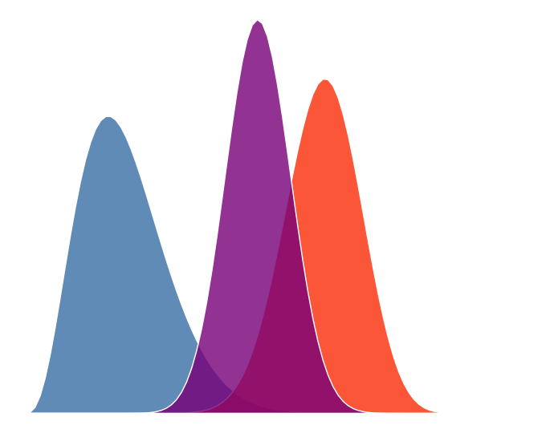

--- 
title: "Notes de cours - Introduction à la modélisation statistique bayésienne"
subtitle: "Un cours avec R, Stan, et brms"
author: "Ladislas Nalborczyk"
date: "Dernière mise à jour : `r format(Sys.Date(), '%d-%m-%Y')`"
site: bookdown::bookdown_site
documentclass: memoir
classoption: a4paper,11pt,twoside,onecolumn,openright,final,oldfontcommands
lot: false
lof: false
bibliography:
  - bib/IMSB.bib
  - bib/packages.bib
colorlinks: true
link-citations: yes
nocite: |
  @R-base, @R-bookdown, @R-knitr, @R-rmarkdown, @R-ggplot2, @R-brms, @R-tidyverse, @R-papaja
description: |
    Ce document regroupe les notes de l'édition 2022 de la formation doctorale
    'Introduction à la modélisation statistique bayésienne', co-organisée par le collège
    des écoles doctorales de l’Université Grenoble Alpes et la Maison de la Modélisation
    et de la Simulation, Nanoscience et Environnement (MaiMoSiNE).
url: "https://www.barelysignificant.com/IMSB2022/notes/docs"
cover-image: "./figures/cover_distributions.png"
favicon: "./figures/cover_distributions.png"
---

# Préface {.unnumbered}

```{r cover-html, eval = knitr::opts_knit$get("rmarkdown.pandoc.to") == "html", echo = FALSE, fig.align = "center", out.width = "50%"}

```

\pagenumbering{arabic} <!-- switch numbering from roman to arabic -->

Ce document regroupe les notes de l'édition 2022 de la formation doctorale "Introduction à la modélisation statistique bayésienne", co-organisée par le collège des écoles doctorales de l'Université Grenoble Alpes et la Maison de la Modélisation et de la Simulation, Nanoscience, et Environnement (MaiMoSiNE).

Ces notes de cours sont organisées en suivant la structure du cours, avec un chapitre par cours, résumant les notions essentielles et donnant quelques éléments de contexte et/ou techniques supplémentaires, pour les plus curieux.

Vous pouvez télécharger la version PDF de ce document en cliquant sur l'icône PDF dans la barre d'outils figurant tout en haut de la version en ligne de ce document. Les slides, données, et codes utilisés sont également disponibles sur le répertoire Github du cours : https://github.com/lnalborczyk/IMSB2022.

Le contenu de ce livret est largement inspiré du livre *Statistical rethinking* [@mcelreath_statistical_2016; @mcelreath_statistical_2020] et des cours partagés librement en ligne par l'auteur. Par ailleurs, le format (HTML) du livret est en partie repris du livre *Introduction to Econometrics with R* [@hanck_introduction_2018], disponible [en ligne](https://bookdown.org/machar1991/ITER/).

Enfin, ce document est diffusé sous une licence *Creative Commons Attribution - Pas d’utilisation commerciale - Partage dans les mêmes conditions* (https://creativecommons.org/licenses/by-nc-sa/3.0/fr/). Cela signifie donc que vous êtes libre de recopier / modifier / redistribuer le contenu, à condition que vous citiez la source et que vos modifications soient elle-mêmes distribuées sous la même licence (autorisant ainsi d’autres à pouvoir réutiliser à leur tour vos ajouts).

```{r writebib, include = FALSE, eval = FALSE, warning = FALSE}
# automatically creates a .bib file for all installed R packages
knitr::write_bib(x = installed.packages()[, 1], file = "bib/packages.bib")
```
